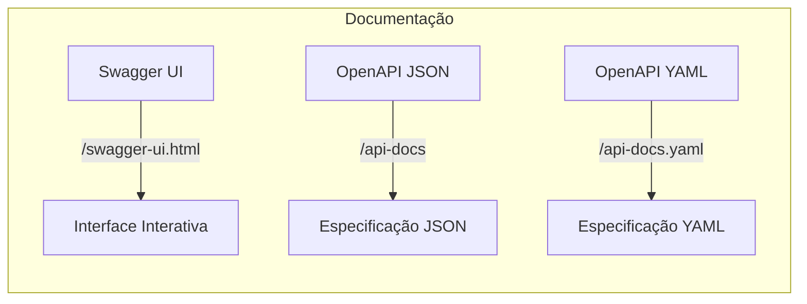
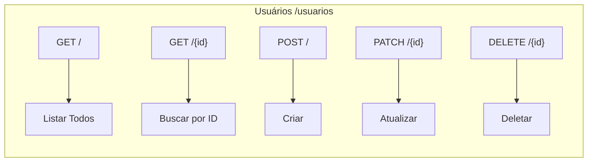
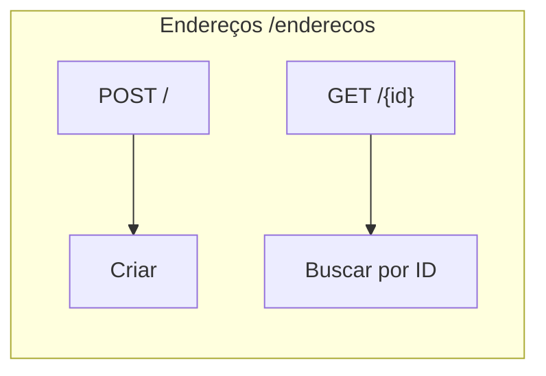
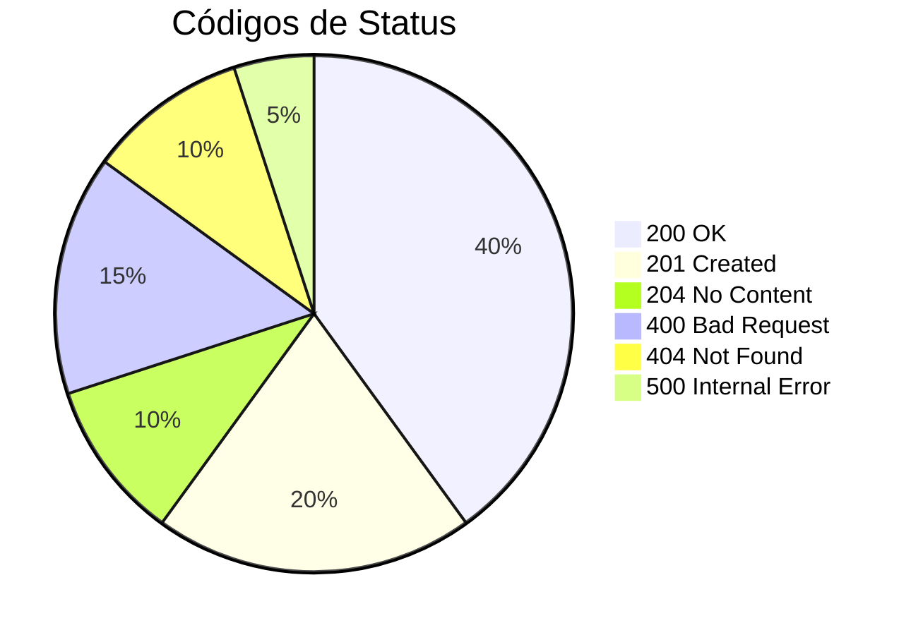
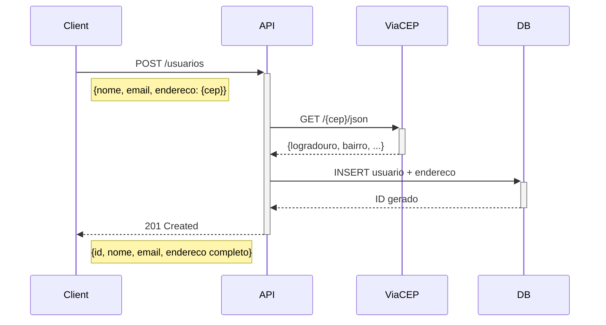

# 📡 Documentação da API REST

## 📋 Índice

- [Informações Gerais](#informações-gerais)
- [Swagger / OpenAPI](#swagger--openapi)
- [Autenticação](#autenticação)
- [Endpoints de Usuários](#endpoints-de-usuários)
- [Endpoints de Endereços](#endpoints-de-endereços)
- [Códigos de Status HTTP](#códigos-de-status-http)
- [Modelos de Dados](#modelos-de-dados)
- [Exemplos de Uso](#exemplos-de-uso)
- [Erros](#erros)

---

## Informações Gerais

| Informação | Valor |
|------------|-------|
| **Base URL** | `http://localhost:8080` |
| **Versão** | `v1.0.0` |
| **Content-Type** | `application/json` |
| **Charset** | `UTF-8` |

### Headers Padrão

```http
Content-Type: application/json
Accept: application/json
```

---

## Swagger / OpenAPI

A API possui documentação interativa completa via **SpringDoc OpenAPI 3.0**.

### URLs de Acesso



| Recurso | URL | Descrição |
|---------|-----|-----------|
| **Swagger UI** | [http://localhost:8080/swagger-ui.html](http://localhost:8080/swagger-ui.html) | Interface web interativa |
| **OpenAPI JSON** | [http://localhost:8080/api-docs](http://localhost:8080/api-docs) | Especificação em JSON |
| **OpenAPI YAML** | [http://localhost:8080/api-docs.yaml](http://localhost:8080/api-docs.yaml) | Especificação em YAML |

### Funcionalidades do Swagger UI

- 🔹 **Try it out**: Execute requisições diretamente na interface
- 🔹 **Schemas**: Visualize a estrutura dos DTOs
- 🔹 **Exemplos**: Request/response com dados de exemplo
- 🔹 **Validações**: Campos obrigatórios destacados
- 🔹 **Filtro**: Pesquisa rápida de endpoints
- 🔹 **Tempo de resposta**: Exibe duração das requisições

### Configuração

A configuração do OpenAPI está em `OpenApiConfig.java`:

```java
@Configuration
public class OpenApiConfig {
    @Bean
    public OpenAPI customOpenAPI() {
        return new OpenAPI()
            .info(new Info()
                .title("API de Gerenciamento de Usuários")
                .version("1.0.0")
                .description("API RESTful para gerenciamento de usuários e endereços")
                .contact(new Contact()
                    .name("gabitxt")
                    .url("https://github.com/Gabxt28"))
                .license(new License()
                    .name("MIT License")))
            .servers(List.of(
                new Server()
                    .url("http://localhost:8080")
                    .description("Servidor de Desenvolvimento")));
    }
}
```

### Tags Disponíveis

| Tag | Descrição |
|-----|-----------|
| **Usuários** | Endpoints para gerenciamento de usuários |
| **Endereços** | Endpoints para gerenciamento de endereços com integração ViaCEP |

---

## Autenticação

> ⚠️ **Nota:** Atualmente a API não requer autenticação. A implementação de segurança está planejada para sprints futuras.

---

## Endpoints de Usuários

### Visão Geral



---

### 📋 Listar Todos os Usuários

Retorna uma lista com todos os usuários cadastrados.

**Endpoint:** `GET /usuarios`

**Request:**
```http
GET /usuarios HTTP/1.1
Host: localhost:8080
Accept: application/json
```

**Response:** `200 OK`
```json
[
  {
    "id": 1,
    "nome": "João Silva",
    "email": "joao@email.com",
    "dataNascimento": "1990-05-15",
    "tipoDocumento": "CPF",
    "numeroDocumento": "12345678901",
    "endereco": {
      "id": 1,
      "cep": "01310100",
      "numero": 123,
      "logradouro": "Avenida Paulista",
      "complemento": "Apto 45",
      "bairro": "Bela Vista",
      "localidade": "São Paulo",
      "estado": "SP",
      "regiao": "Sudeste"
    }
  }
]
```

**cURL:**
```bash
curl -X GET http://localhost:8080/usuarios \
  -H "Accept: application/json"
```

---

### 🔍 Buscar Usuário por ID

Retorna um usuário específico pelo seu ID.

**Endpoint:** `GET /usuarios/{id}`

**Parâmetros de Path:**

| Parâmetro | Tipo | Obrigatório | Descrição |
|-----------|------|-------------|-----------|
| `id` | Long | Sim | ID do usuário |

**Request:**
```http
GET /usuarios/1 HTTP/1.1
Host: localhost:8080
Accept: application/json
```

**Response:** `200 OK`
```json
{
  "id": 1,
  "nome": "João Silva",
  "email": "joao@email.com",
  "dataNascimento": "1990-05-15",
  "tipoDocumento": "CPF",
  "numeroDocumento": "12345678901",
  "endereco": {
    "id": 1,
    "cep": "01310100",
    "numero": 123,
    "logradouro": "Avenida Paulista",
    "complemento": "Apto 45",
    "bairro": "Bela Vista",
    "localidade": "São Paulo",
    "estado": "SP",
    "regiao": "Sudeste"
  }
}
```

**Response:** `404 Not Found` (quando não encontrado)
```json
{
  "timestamp": "2026-01-08T12:00:00",
  "status": 404,
  "error": "Not Found",
  "message": "Usuário não encontrado com id: 999",
  "path": "/usuarios/999"
}
```

**cURL:**
```bash
curl -X GET http://localhost:8080/usuarios/1 \
  -H "Accept: application/json"
```

---

### ➕ Criar Usuário

Cria um novo usuário no sistema.

**Endpoint:** `POST /usuarios`

**Request Body:**

| Campo | Tipo | Obrigatório | Descrição |
|-------|------|-------------|-----------|
| `nome` | String | Sim | Nome completo (max: 100) |
| `email` | String | Sim | Email único (max: 150) |
| `dataNascimento` | Date | Não | Formato: YYYY-MM-DD |
| `tipoDocumento` | Enum | Não | CPF ou CNPJ |
| `numeroDocumento` | String | Sim | Número do documento |
| `endereco` | Object | Não | Dados do endereço |
| `endereco.cep` | String | Sim* | CEP (8 dígitos) |
| `endereco.numero` | Integer | Não | Número do logradouro |
| `endereco.complemento` | String | Não | Complemento |

**Request:**
```http
POST /usuarios HTTP/1.1
Host: localhost:8080
Content-Type: application/json

{
  "nome": "João Silva",
  "email": "joao@email.com",
  "dataNascimento": "1990-05-15",
  "tipoDocumento": "CPF",
  "numeroDocumento": "12345678901",
  "endereco": {
    "cep": "01310100",
    "numero": 123,
    "complemento": "Apto 45"
  }
}
```

**Response:** `201 Created`

**Headers:**
```http
Location: /usuarios/1
```

**Body:**
```json
{
  "id": 1,
  "nome": "João Silva",
  "email": "joao@email.com",
  "dataNascimento": "1990-05-15",
  "tipoDocumento": "CPF",
  "numeroDocumento": "12345678901",
  "endereco": {
    "id": 1,
    "cep": "01310100",
    "numero": 123,
    "logradouro": "Avenida Paulista",
    "complemento": "Apto 45",
    "bairro": "Bela Vista",
    "localidade": "São Paulo",
    "estado": "SP",
    "regiao": "Sudeste"
  }
}
```

**cURL:**
```bash
curl -X POST http://localhost:8080/usuarios \
  -H "Content-Type: application/json" \
  -d '{
    "nome": "João Silva",
    "email": "joao@email.com",
    "dataNascimento": "1990-05-15",
    "tipoDocumento": "CPF",
    "numeroDocumento": "12345678901",
    "endereco": {
      "cep": "01310100",
      "numero": 123,
      "complemento": "Apto 45"
    }
  }'
```

---

### ✏️ Atualizar Usuário

Atualiza parcialmente os dados de um usuário existente.

**Endpoint:** `PATCH /usuarios/{id}`

**Parâmetros de Path:**

| Parâmetro | Tipo | Obrigatório | Descrição |
|-----------|------|-------------|-----------|
| `id` | Long | Sim | ID do usuário |

**Request Body:**

| Campo | Tipo | Obrigatório | Descrição |
|-------|------|-------------|-----------|
| `nome` | String | Não | Nome completo |
| `email` | String | Não | Email único |
| `dataNascimento` | Date | Não | Formato: YYYY-MM-DD |
| `tipoDocumento` | Enum | Não | CPF ou CNPJ |
| `numeroDocumento` | String | Não | Número do documento |

**Request:**
```http
PATCH /usuarios/1 HTTP/1.1
Host: localhost:8080
Content-Type: application/json

{
  "nome": "João Silva Santos",
  "email": "joao.santos@email.com"
}
```

**Response:** `200 OK`
```json
{
  "id": 1,
  "nome": "João Silva Santos",
  "email": "joao.santos@email.com",
  "dataNascimento": "1990-05-15",
  "tipoDocumento": "CPF",
  "numeroDocumento": "12345678901",
  "endereco": null
}
```

**cURL:**
```bash
curl -X PATCH http://localhost:8080/usuarios/1 \
  -H "Content-Type: application/json" \
  -d '{
    "nome": "João Silva Santos",
    "email": "joao.santos@email.com"
  }'
```

---

### 🗑️ Deletar Usuário

Remove um usuário do sistema.

**Endpoint:** `DELETE /usuarios/{id}`

**Parâmetros de Path:**

| Parâmetro | Tipo | Obrigatório | Descrição |
|-----------|------|-------------|-----------|
| `id` | Long | Sim | ID do usuário |

**Request:**
```http
DELETE /usuarios/1 HTTP/1.1
Host: localhost:8080
```

**Response:** `204 No Content`

> Sem corpo na resposta.

**Response:** `404 Not Found` (quando não encontrado)
```json
{
  "timestamp": "2026-01-08T12:00:00",
  "status": 404,
  "error": "Not Found",
  "message": "Usuário não encontrado",
  "path": "/usuarios/999"
}
```

**cURL:**
```bash
curl -X DELETE http://localhost:8080/usuarios/1
```

---

## Endpoints de Endereços

### Visão Geral



---

### ➕ Criar Endereço

Cria um novo endereço, preenchendo automaticamente dados via ViaCEP.

**Endpoint:** `POST /enderecos`

**Request Body:**

| Campo | Tipo | Obrigatório | Descrição |
|-------|------|-------------|-----------|
| `cep` | String | Sim | CEP (8 dígitos) |
| `numero` | Integer | Não | Número do logradouro |
| `complemento` | String | Não | Complemento |

**Request:**
```http
POST /enderecos HTTP/1.1
Host: localhost:8080
Content-Type: application/json

{
  "cep": "01310100",
  "numero": 123,
  "complemento": "Apto 45"
}
```

**Response:** `200 OK`
```json
{
  "id": 1,
  "cep": "01310100",
  "numero": 123,
  "logradouro": "Avenida Paulista",
  "complemento": "Apto 45",
  "bairro": "Bela Vista",
  "localidade": "São Paulo",
  "estado": "SP",
  "regiao": "Sudeste"
}
```

**cURL:**
```bash
curl -X POST http://localhost:8080/enderecos \
  -H "Content-Type: application/json" \
  -d '{
    "cep": "01310100",
    "numero": 123,
    "complemento": "Apto 45"
  }'
```

---

## Códigos de Status HTTP



| Código | Status | Descrição | Quando Usar |
|--------|--------|-----------|-------------|
| `200` | OK | Requisição bem-sucedida | GET, PATCH |
| `201` | Created | Recurso criado | POST |
| `204` | No Content | Sem conteúdo | DELETE |
| `400` | Bad Request | Erro de validação | Dados inválidos |
| `404` | Not Found | Recurso não encontrado | ID inexistente |
| `409` | Conflict | Conflito | Email duplicado |
| `500` | Internal Server Error | Erro interno | Exceções não tratadas |
| `503` | Service Unavailable | Serviço indisponível | ViaCEP offline |

---

## Modelos de Dados

### UsuarioDTO

```json
{
  "id": "Long",
  "nome": "String (max: 100)",
  "email": "String (max: 150)",
  "dataNascimento": "LocalDate (YYYY-MM-DD)",
  "tipoDocumento": "TipoDocumento (CPF | CNPJ)",
  "numeroDocumento": "String (max: 20)",
  "endereco": "EnderecoDTO | null"
}
```

### EnderecoDTO

```json
{
  "id": "Long",
  "numero": "Integer",
  "cep": "String (8-9 chars)",
  "logradouro": "String (max: 200)",
  "complemento": "String (max: 100)",
  "bairro": "String (max: 100)",
  "localidade": "String (max: 100)",
  "estado": "String (2 chars)",
  "regiao": "String (max: 50)"
}
```

### CriarUsuarioRequest

```json
{
  "nome": "String (required)",
  "email": "String (required)",
  "dataNascimento": "LocalDate (optional)",
  "tipoDocumento": "TipoDocumento (optional)",
  "numeroDocumento": "String (required)",
  "endereco": "CriarEnderecoRequest (optional)"
}
```

### CriarEnderecoRequest

```json
{
  "cep": "String (required)",
  "numero": "Integer (optional)",
  "complemento": "String (optional)"
}
```

### ErrorResponse

```json
{
  "timestamp": "LocalDateTime",
  "status": "Integer",
  "error": "String",
  "message": "String",
  "path": "String"
}
```

---

## Exemplos de Uso

### Fluxo Completo: Criar Usuário com Endereço



### Exemplo com HTTPie

```bash
# Criar usuário
http POST localhost:8080/usuarios \
  nome="Maria Silva" \
  email="maria@email.com" \
  numeroDocumento="98765432100" \
  tipoDocumento="CPF" \
  endereco:='{"cep":"04538133","numero":500}'

# Listar usuários
http GET localhost:8080/usuarios

# Buscar por ID
http GET localhost:8080/usuarios/1

# Atualizar usuário
http PATCH localhost:8080/usuarios/1 \
  nome="Maria Silva Santos"

# Deletar usuário
http DELETE localhost:8080/usuarios/1
```

---

## Erros

### Formato de Erro Padrão

```json
{
  "timestamp": "2026-01-08T12:00:00.000",
  "status": 400,
  "error": "Bad Request",
  "message": "Descrição do erro",
  "path": "/usuarios"
}
```

### Erros Comuns

| Status | Mensagem | Causa | Solução |
|--------|----------|-------|---------|
| 400 | "Email é obrigatório" | Campo email não informado | Informar email válido |
| 400 | "JSON mal formado" | Erro de sintaxe no JSON | Corrigir sintaxe |
| 404 | "Usuário não encontrado" | ID não existe | Verificar ID |
| 409 | "Email já cadastrado" | Email duplicado | Usar outro email |
| 503 | "Serviço ViaCEP indisponível" | API externa offline | Tentar novamente |

---

<p align="center">
  <a href="./README.md">← Voltar ao Índice</a>
</p>

