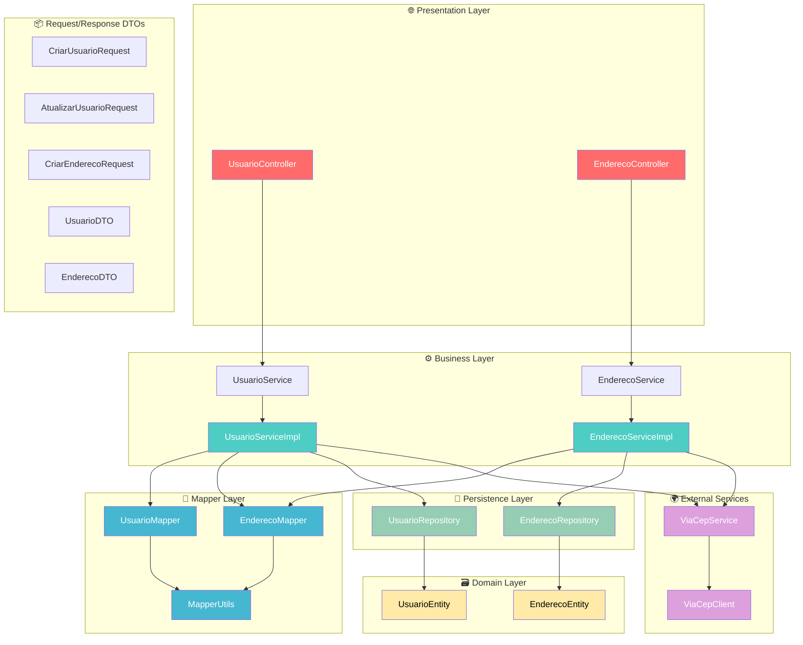
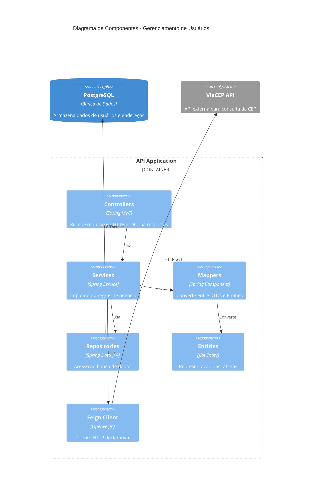
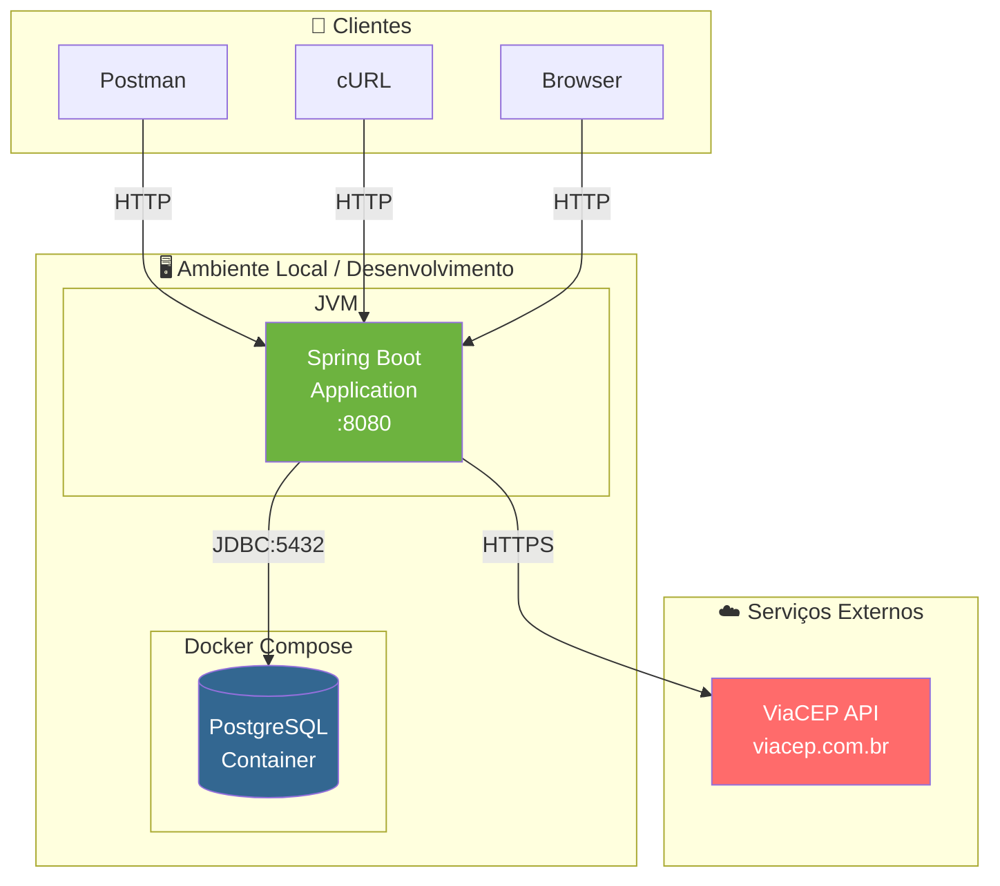
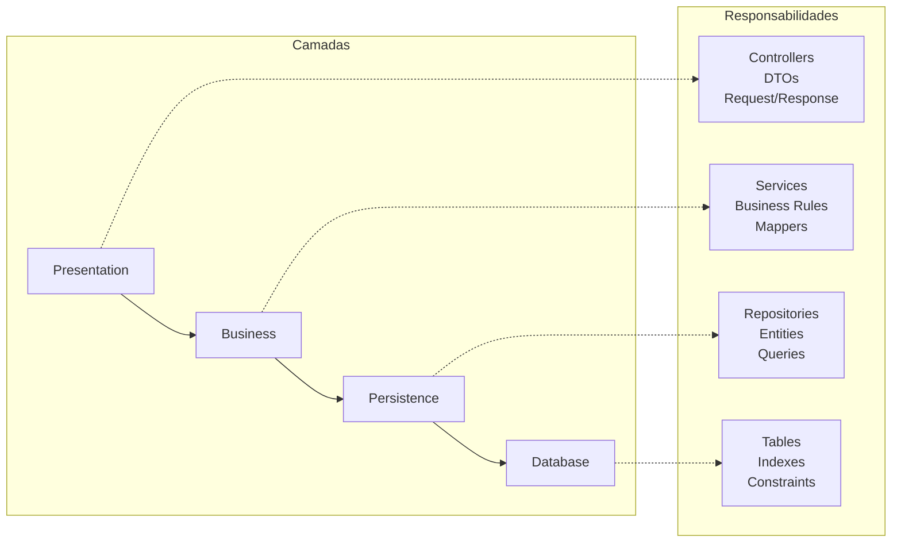
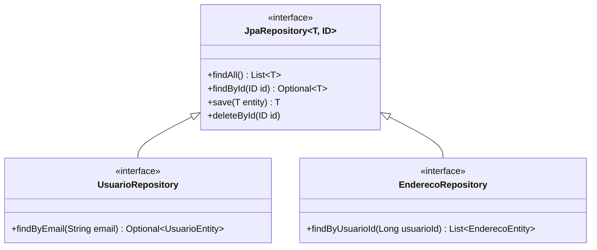
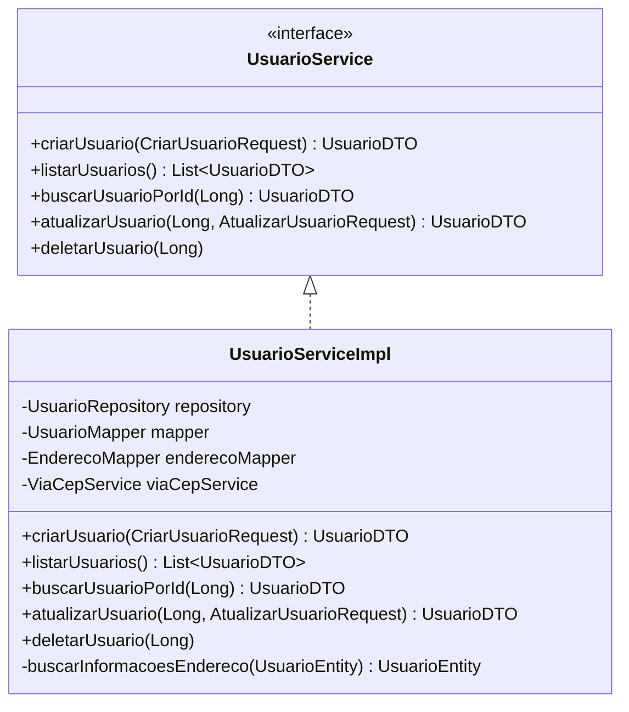
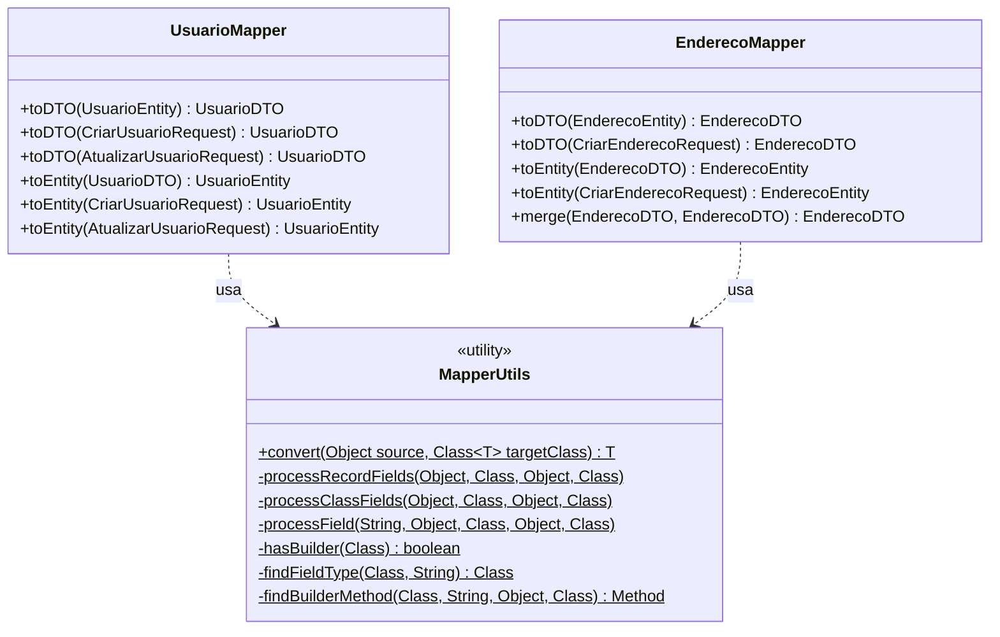
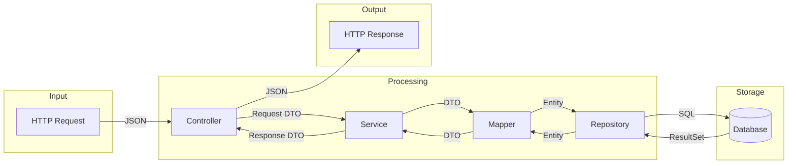

# 🏗️ Arquitetura do Sistema

## 📋 Índice

- [Visão Geral](#visão-geral)
- [Arquitetura em Camadas](#arquitetura-em-camadas)
- [Diagrama de Componentes](#diagrama-de-componentes)
- [Diagrama de Implantação](#diagrama-de-implantação)
- [Padrões Arquiteturais](#padrões-arquiteturais)
- [Decisões de Arquitetura](#decisões-de-arquitetura)

---

## Visão Geral

O sistema **Gerenciamento de Usuários** é uma aplicação backend desenvolvida seguindo os princípios de **Clean Architecture** e **Domain-Driven Design (DDD)** simplificado, utilizando uma arquitetura em camadas bem definida.

### Características Principais

- **Arquitetura em Camadas**: Separação clara de responsabilidades
- **RESTful API**: Interface HTTP seguindo padrões REST
- **Inversão de Dependência**: Services dependem de abstrações
- **Mappers Genéricos**: Conversão de objetos com SOLID

---

## Arquitetura em Camadas

---

## Diagrama de Componentes

---

## Diagrama de Implantação

---

## Padrões Arquiteturais

### 1. Layered Architecture (Arquitetura em Camadas)

### 2. Repository Pattern

### 3. Service Layer Pattern

### 4. Mapper Pattern (com SOLID)

---

## Decisões de Arquitetura

### ADR-001: Uso de Records para DTOs

| Item | Descrição |
|------|-----------|
| **Status** | Aceito |
| **Contexto** | DTOs precisam ser imutáveis e ter menos boilerplate |
| **Decisão** | Usar Java Records com `@Builder(toBuilder = true)` do Lombok |
| **Consequências** | ✅ Imutabilidade garantida ✅ Menos código ✅ equals/hashCode automáticos ⚠️ Requer Java 16+ |

### ADR-002: MapperUtils com Reflection

| Item | Descrição |
|------|-----------|
| **Status** | Aceito |
| **Contexto** | Evitar código repetitivo em conversões de objetos |
| **Decisão** | Criar utilitário genérico usando Reflection e builders do Lombok |
| **Consequências** | ✅ Código DRY ✅ Suporta classes e records ✅ Conversão recursiva ⚠️ Overhead de reflection ⚠️ Erros em runtime |

### ADR-003: Feign Client para Integrações

| Item | Descrição |
|------|-----------|
| **Status** | Aceito |
| **Contexto** | Necessidade de integração com API ViaCEP |
| **Decisão** | Usar Spring Cloud OpenFeign para cliente HTTP declarativo |
| **Consequências** | ✅ Código declarativo ✅ Integração com Spring ✅ Retry/Circuit Breaker ⚠️ Dependência adicional |

### ADR-004: PostgreSQL como Banco de Dados

| Item | Descrição |
|------|-----------|
| **Status** | Aceito |
| **Contexto** | Necessidade de banco relacional robusto |
| **Decisão** | Usar PostgreSQL com Docker Compose |
| **Consequências** | ✅ Open source ✅ Suporte a JSON ✅ Escalável ⚠️ Requer Docker |

---

## Fluxo de Dados

---

  <a href="./README.md">← Voltar ao Índice</a>

