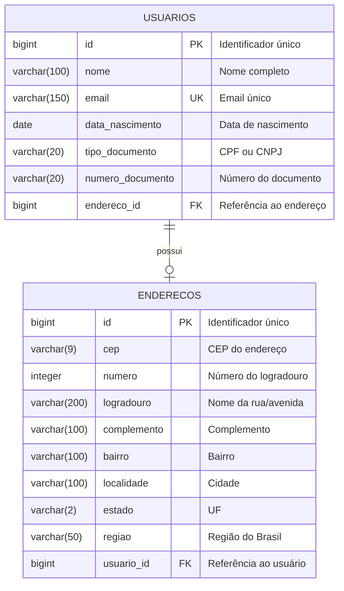
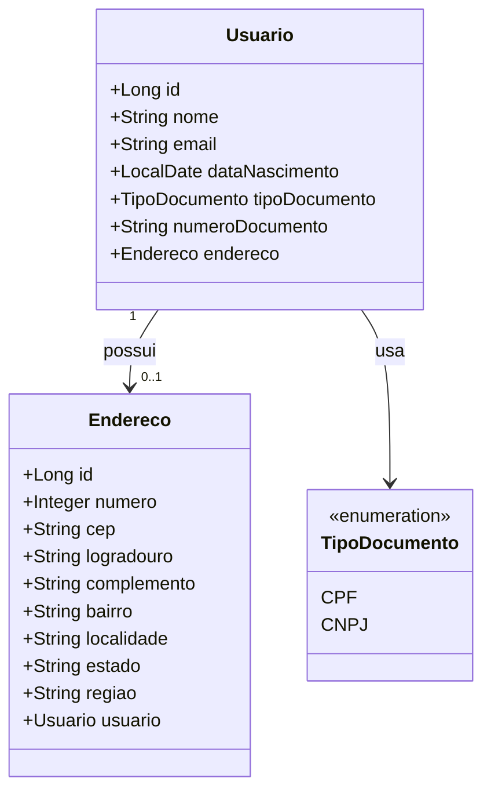
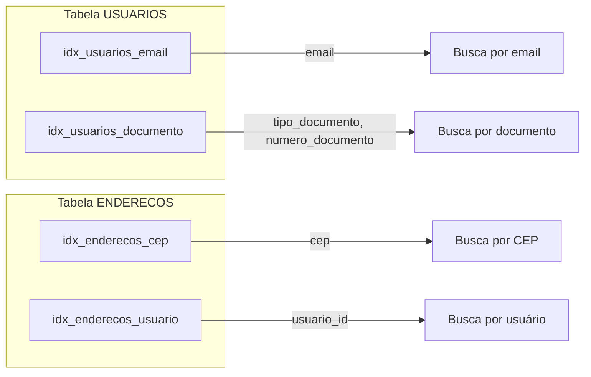
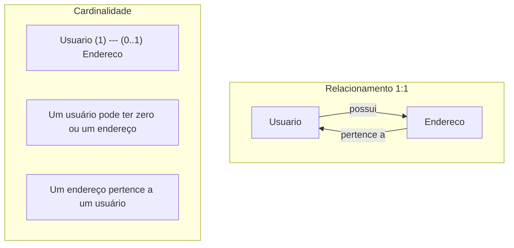

# 🗄️ Banco de Dados

## 📋 Índice

- [Diagrama Entidade-Relacionamento (DER)](#diagrama-entidade-relacionamento-der)
- [Modelo Lógico](#modelo-lógico)
- [Modelo Físico (DDL)](#modelo-físico-ddl)
- [Dicionário de Dados](#dicionário-de-dados)
- [Índices](#índices)
- [Constraints](#constraints)

---

## Diagrama Entidade-Relacionamento (DER)



---

## Modelo Lógico



---

## Modelo Físico (DDL)

### Tabela: USUARIOS

```sql
-- ============================================
-- Tabela: usuarios
-- Descrição: Armazena dados dos usuários
-- ============================================
CREATE TABLE usuarios (
    id                  BIGSERIAL       PRIMARY KEY,
    nome                VARCHAR(100)    NOT NULL,
    email               VARCHAR(150)    NOT NULL UNIQUE,
    data_nascimento     DATE            NULL,
    tipo_documento      VARCHAR(20)     NULL,
    numero_documento    VARCHAR(20)     NOT NULL,
    endereco_id         BIGINT          NULL,
    
    -- Constraints
    CONSTRAINT fk_usuario_endereco 
        FOREIGN KEY (endereco_id) 
        REFERENCES enderecos(id)
        ON DELETE SET NULL
);

-- Índices
CREATE INDEX idx_usuarios_email ON usuarios(email);
CREATE INDEX idx_usuarios_documento ON usuarios(tipo_documento, numero_documento);
```

### Tabela: ENDERECOS

```sql
-- ============================================
-- Tabela: enderecos
-- Descrição: Armazena endereços dos usuários
-- ============================================
CREATE TABLE enderecos (
    id              BIGSERIAL       PRIMARY KEY,
    numero          INTEGER         DEFAULT 0,
    cep             VARCHAR(9)      NOT NULL,
    logradouro      VARCHAR(200)    NULL,
    complemento     VARCHAR(100)    NULL,
    bairro          VARCHAR(100)    NULL,
    localidade      VARCHAR(100)    NULL,
    estado          VARCHAR(2)      NULL,
    regiao          VARCHAR(50)     NULL,
    usuario_id      BIGINT          NULL,
    
    -- Constraints
    CONSTRAINT fk_endereco_usuario 
        FOREIGN KEY (usuario_id) 
        REFERENCES usuarios(id)
        ON DELETE CASCADE
);

-- Índices
CREATE INDEX idx_enderecos_cep ON enderecos(cep);
CREATE INDEX idx_enderecos_usuario ON enderecos(usuario_id);
```

### Script Completo

```sql
-- ============================================
-- Script de criação do banco de dados
-- Gerenciamento de Usuários
-- ============================================

-- Criar banco de dados (se necessário)
-- CREATE DATABASE gerenciamento_usuario_db;

-- Conectar ao banco
-- \c gerenciamento_usuario_db

-- Dropar tabelas existentes (ordem inversa de dependências)
DROP TABLE IF EXISTS enderecos CASCADE;
DROP TABLE IF EXISTS usuarios CASCADE;

-- Criar tabela de endereços primeiro (sem FK)
CREATE TABLE enderecos (
    id              BIGSERIAL       PRIMARY KEY,
    numero          INTEGER         DEFAULT 0,
    cep             VARCHAR(9)      NOT NULL,
    logradouro      VARCHAR(200)    NULL,
    complemento     VARCHAR(100)    NULL,
    bairro          VARCHAR(100)    NULL,
    localidade      VARCHAR(100)    NULL,
    estado          VARCHAR(2)      NULL,
    regiao          VARCHAR(50)     NULL,
    usuario_id      BIGINT          NULL
);

-- Criar tabela de usuários
CREATE TABLE usuarios (
    id                  BIGSERIAL       PRIMARY KEY,
    nome                VARCHAR(100)    NOT NULL,
    email               VARCHAR(150)    NOT NULL UNIQUE,
    data_nascimento     DATE            NULL,
    tipo_documento      VARCHAR(20)     NULL,
    numero_documento    VARCHAR(20)     NOT NULL,
    endereco_id         BIGINT          NULL,
    
    CONSTRAINT fk_usuario_endereco 
        FOREIGN KEY (endereco_id) 
        REFERENCES enderecos(id)
        ON DELETE SET NULL
);

-- Adicionar FK em endereços
ALTER TABLE enderecos
    ADD CONSTRAINT fk_endereco_usuario 
    FOREIGN KEY (usuario_id) 
    REFERENCES usuarios(id)
    ON DELETE CASCADE;

-- Criar índices
CREATE INDEX idx_usuarios_email ON usuarios(email);
CREATE INDEX idx_usuarios_documento ON usuarios(tipo_documento, numero_documento);
CREATE INDEX idx_enderecos_cep ON enderecos(cep);
CREATE INDEX idx_enderecos_usuario ON enderecos(usuario_id);

-- Comentários nas tabelas
COMMENT ON TABLE usuarios IS 'Tabela de usuários do sistema';
COMMENT ON TABLE enderecos IS 'Tabela de endereços dos usuários';

COMMENT ON COLUMN usuarios.id IS 'Identificador único do usuário';
COMMENT ON COLUMN usuarios.nome IS 'Nome completo do usuário';
COMMENT ON COLUMN usuarios.email IS 'Email único do usuário';
COMMENT ON COLUMN usuarios.data_nascimento IS 'Data de nascimento';
COMMENT ON COLUMN usuarios.tipo_documento IS 'Tipo do documento (CPF/CNPJ)';
COMMENT ON COLUMN usuarios.numero_documento IS 'Número do documento';

COMMENT ON COLUMN enderecos.id IS 'Identificador único do endereço';
COMMENT ON COLUMN enderecos.cep IS 'CEP do endereço (formato: 00000000 ou 00000-000)';
COMMENT ON COLUMN enderecos.numero IS 'Número do logradouro';
COMMENT ON COLUMN enderecos.logradouro IS 'Nome da rua, avenida, etc.';
COMMENT ON COLUMN enderecos.complemento IS 'Complemento do endereço';
COMMENT ON COLUMN enderecos.bairro IS 'Nome do bairro';
COMMENT ON COLUMN enderecos.localidade IS 'Nome da cidade';
COMMENT ON COLUMN enderecos.estado IS 'Sigla do estado (UF)';
COMMENT ON COLUMN enderecos.regiao IS 'Região do Brasil';
```

---

## Dicionário de Dados

### Tabela: USUARIOS

| Coluna | Tipo | Tamanho | Nulo | Default | Descrição |
|--------|------|---------|------|---------|-----------|
| `id` | BIGSERIAL | - | NOT NULL | auto_increment | Chave primária |
| `nome` | VARCHAR | 100 | NOT NULL | - | Nome completo do usuário |
| `email` | VARCHAR | 150 | NOT NULL | - | Email único do usuário |
| `data_nascimento` | DATE | - | NULL | - | Data de nascimento |
| `tipo_documento` | VARCHAR | 20 | NULL | - | Tipo: CPF ou CNPJ |
| `numero_documento` | VARCHAR | 20 | NOT NULL | - | Número do documento |
| `endereco_id` | BIGINT | - | NULL | - | FK para tabela enderecos |

### Tabela: ENDERECOS

| Coluna | Tipo | Tamanho | Nulo | Default | Descrição |
|--------|------|---------|------|---------|-----------|
| `id` | BIGSERIAL | - | NOT NULL | auto_increment | Chave primária |
| `numero` | INTEGER | - | NULL | 0 | Número do logradouro |
| `cep` | VARCHAR | 9 | NOT NULL | - | CEP (00000-000) |
| `logradouro` | VARCHAR | 200 | NULL | - | Nome da rua/avenida |
| `complemento` | VARCHAR | 100 | NULL | - | Complemento (apto, bloco) |
| `bairro` | VARCHAR | 100 | NULL | - | Nome do bairro |
| `localidade` | VARCHAR | 100 | NULL | - | Nome da cidade |
| `estado` | VARCHAR | 2 | NULL | - | Sigla do estado (UF) |
| `regiao` | VARCHAR | 50 | NULL | - | Região (Norte, Sul, etc.) |
| `usuario_id` | BIGINT | - | NULL | - | FK para tabela usuarios |

### Enumeração: TIPO_DOCUMENTO

| Valor | Descrição |
|-------|-----------|
| `CPF` | Cadastro de Pessoa Física (11 dígitos) |
| `CNPJ` | Cadastro Nacional de Pessoa Jurídica (14 dígitos) |

---

## Índices



| Tabela | Índice | Colunas | Tipo | Justificativa |
|--------|--------|---------|------|---------------|
| usuarios | `idx_usuarios_email` | email | BTREE | Busca frequente por email |
| usuarios | `idx_usuarios_documento` | tipo_documento, numero_documento | BTREE | Busca composta por documento |
| enderecos | `idx_enderecos_cep` | cep | BTREE | Busca por CEP |
| enderecos | `idx_enderecos_usuario` | usuario_id | BTREE | JOIN com usuários |

---

## Constraints

### Chaves Primárias (PK)

| Tabela | Constraint | Coluna |
|--------|------------|--------|
| usuarios | `usuarios_pkey` | id |
| enderecos | `enderecos_pkey` | id |

### Chaves Estrangeiras (FK)

| Tabela | Constraint | Coluna | Referência | On Delete |
|--------|------------|--------|------------|-----------|
| usuarios | `fk_usuario_endereco` | endereco_id | enderecos(id) | SET NULL |
| enderecos | `fk_endereco_usuario` | usuario_id | usuarios(id) | CASCADE |

### Unique Constraints

| Tabela | Constraint | Coluna |
|--------|------------|--------|
| usuarios | `usuarios_email_key` | email |

---

## Queries Úteis

### Buscar usuário com endereço

```sql
SELECT 
    u.id,
    u.nome,
    u.email,
    u.tipo_documento,
    u.numero_documento,
    e.cep,
    e.logradouro,
    e.numero,
    e.bairro,
    e.localidade,
    e.estado
FROM usuarios u
LEFT JOIN enderecos e ON u.endereco_id = e.id
WHERE u.id = :id;
```

### Buscar usuários por cidade

```sql
SELECT u.*, e.*
FROM usuarios u
INNER JOIN enderecos e ON u.endereco_id = e.id
WHERE e.localidade = :cidade
ORDER BY u.nome;
```

### Contar usuários por estado

```sql
SELECT 
    e.estado,
    COUNT(u.id) as total_usuarios
FROM usuarios u
INNER JOIN enderecos e ON u.endereco_id = e.id
GROUP BY e.estado
ORDER BY total_usuarios DESC;
```

---

## Relacionamentos



---

<p align="center">
  <a href="./README.md">← Voltar ao Índice</a>
</p>

