# 📊 Diagramas

## 📋 Índice

- [Diagrama de Classes](#diagrama-de-classes)
- [Diagrama de Sequência](#diagramas-de-sequência)
- [Diagrama de Estados](#diagrama-de-estados)
- [Diagrama de Pacotes](#diagrama-de-pacotes)

---

## Diagrama de Classes

### Visão Geral do Domínio

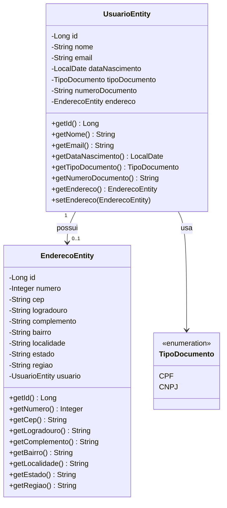

### DTOs e Requests

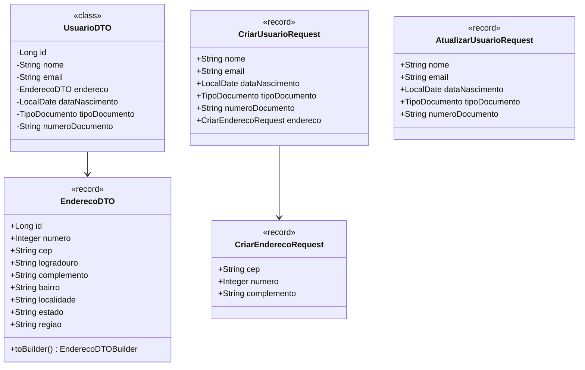

### Controllers

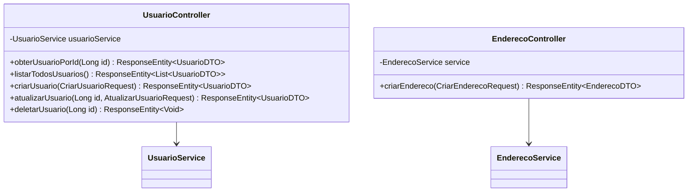

### Services

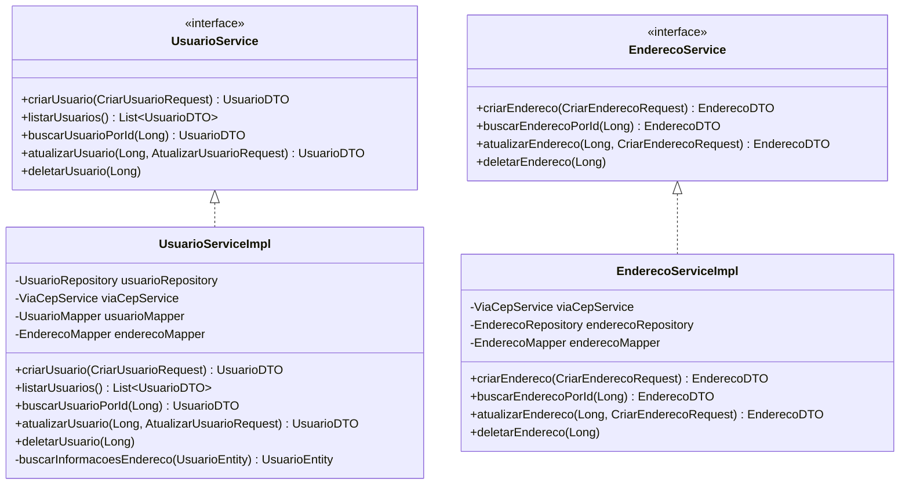

### Mappers

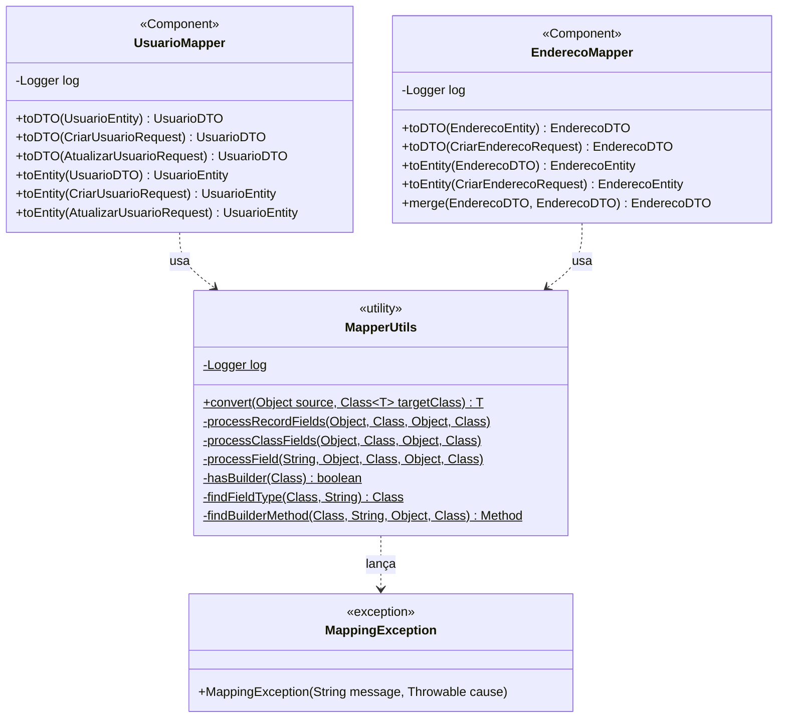

### Repositories

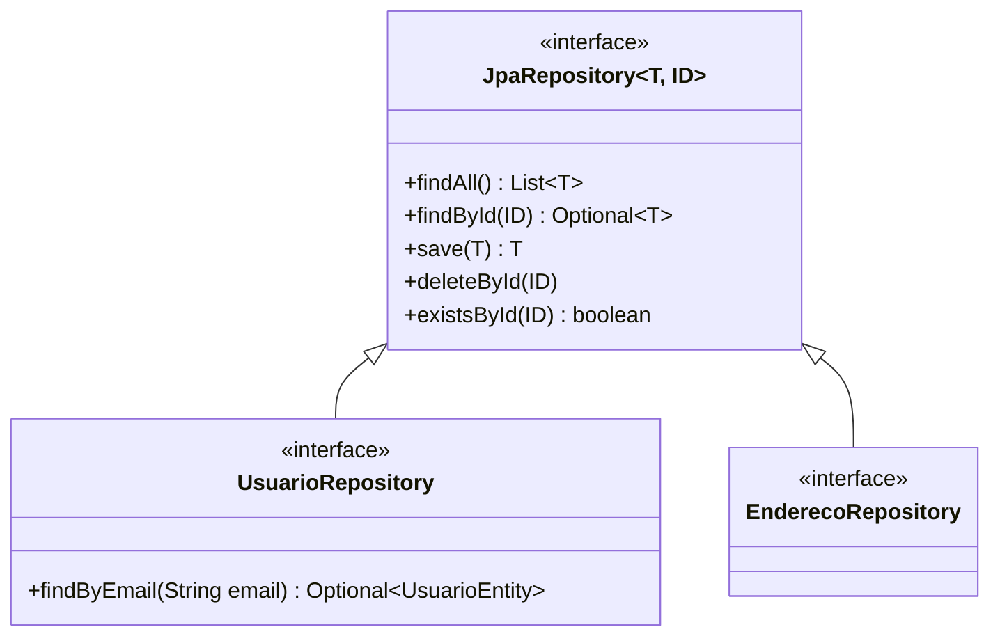

### Integração ViaCEP

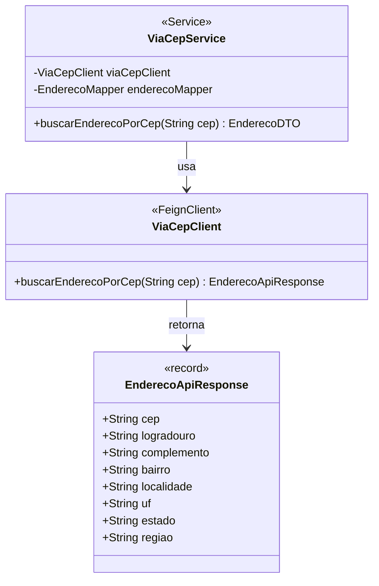

---

## Diagramas de Sequência

### Criar Usuário

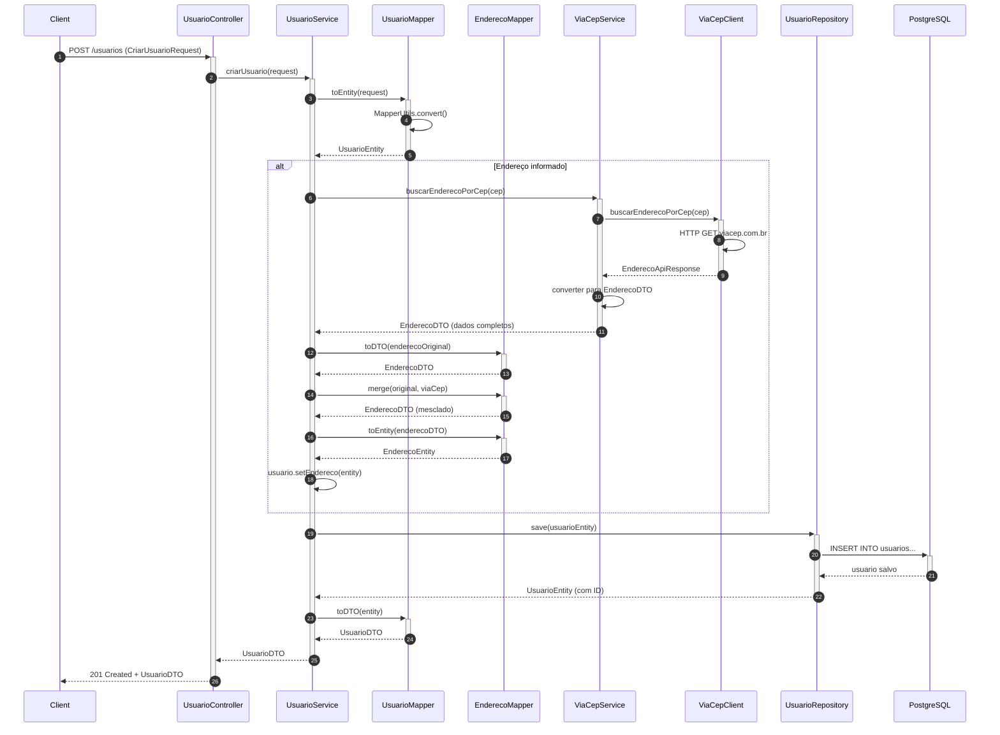

### Buscar Usuário por ID

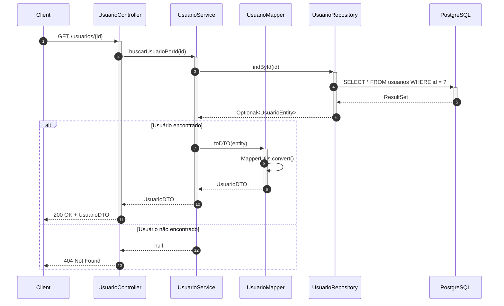

### Atualizar Usuário

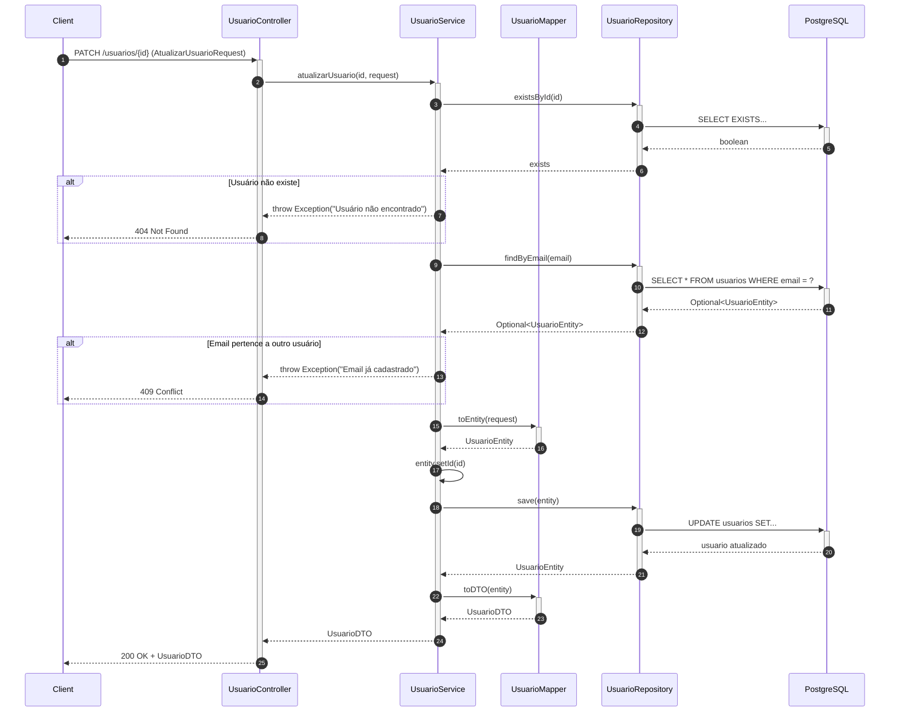

### Deletar Usuário

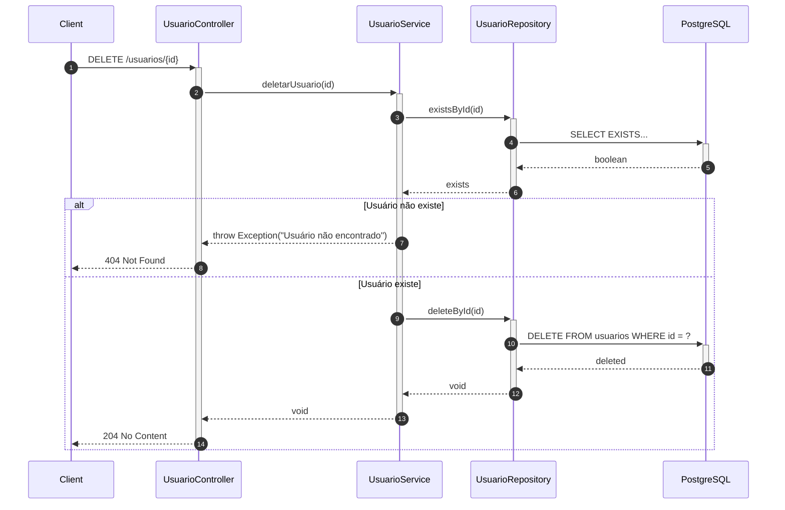

### Criar Endereço

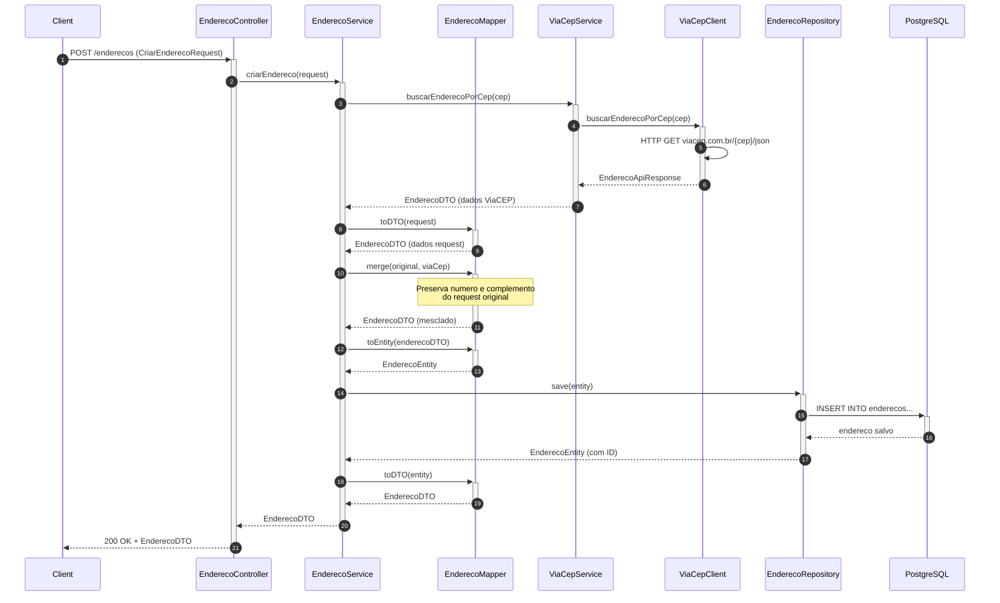

---

## Diagrama de Estados

### Estado do Usuário

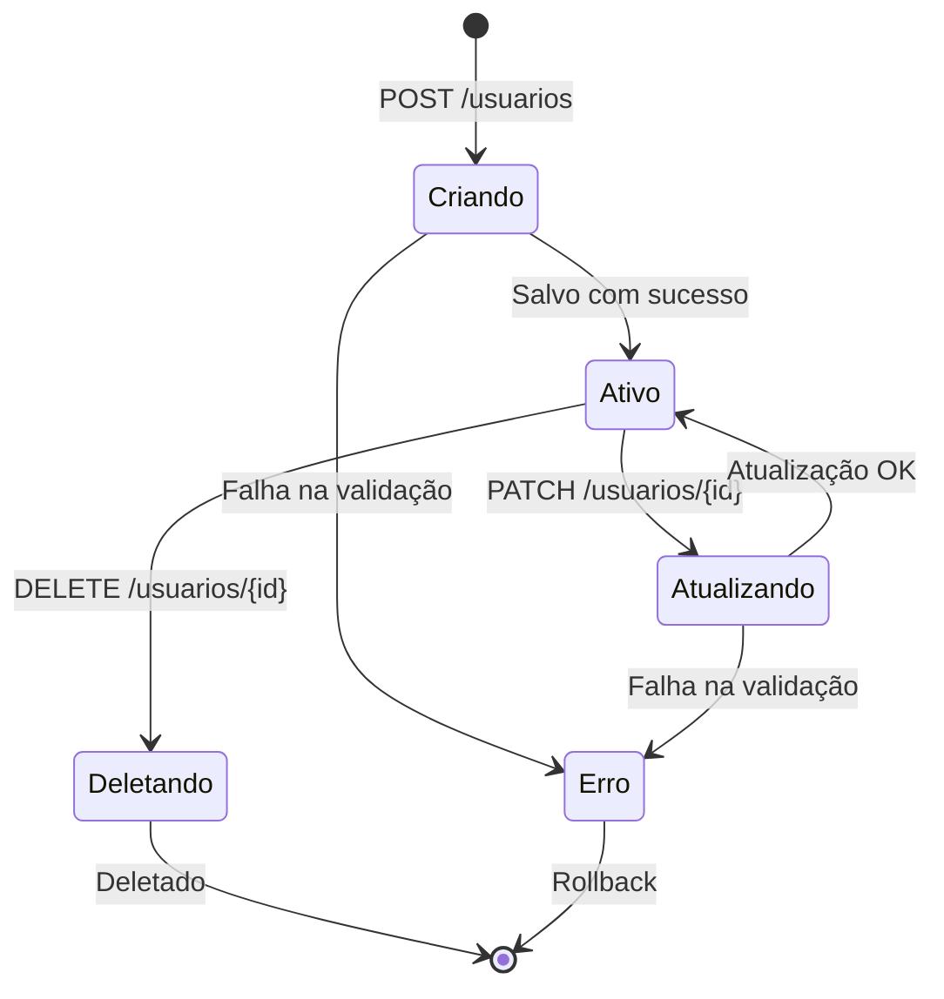

### Estado do Endereço

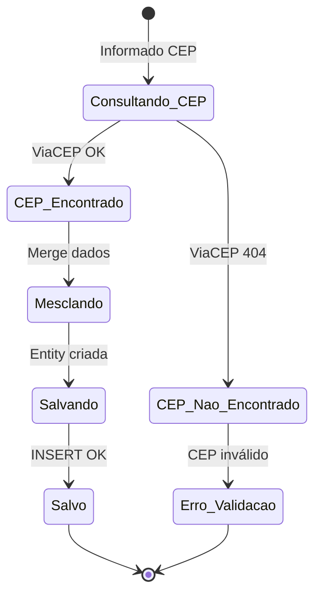

---

## Diagrama de Pacotes

```mermaid
graph TB
    subgraph "io.github.gabitxt.gerenciamentousuario"
        subgraph "api"
            api_client[client]
            api_dto[dto]
            api_service[service]
        end
        
        subgraph "config"
            config_handler[GlobalExceptionHandler]
        end
        
        subgraph "controller"
            ctrl[Controllers]
            ctrl_request[request]
        end
        
        subgraph "entity"
            entities[Entities]
        end
        
        subgraph "enums"
            enums[Enumerations]
        end
        
        subgraph "mapper"
            mappers[Mappers]
        end
        
        subgraph "model"
            models[DTOs]
        end
        
        subgraph "repository"
            repos[Repositories]
        end
        
        subgraph "service"
            services[Services]
        end
    end
    
    ctrl --> services
    services --> mappers
    services --> repos
    services --> api_service
    api_service --> api_client
    repos --> entities
    mappers --> entities
    mappers --> models
    ctrl --> ctrl_request
    ctrl --> models
    entities --> enums
    
    style api fill:#DDA0DD
    style controller fill:#FF6B6B
    style service fill:#4ECDC4
    style mapper fill:#45B7D1
    style repository fill:#96CEB4
    style entity fill:#FFEAA7
    style model fill:#FFA07A
```

---

<p align="center">
  <a href="./README.md">← Voltar ao Índice</a>
</p>

