# 🔄 Fluxos de Negócio

## 📋 Índice

- [Visão Geral dos Casos de Uso](#visão-geral-dos-casos-de-uso)
- [Fluxos Detalhados](#fluxos-detalhados)
- [Regras de Negócio](#regras-de-negócio)
- [Diagramas de Atividade](#diagramas-de-atividade)

---

## Visão Geral dos Casos de Uso

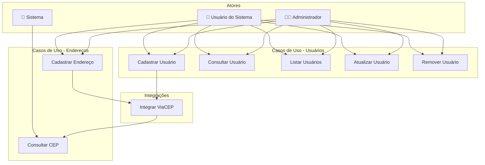

---

## Fluxos Detalhados

### UC01 - Cadastrar Usuário

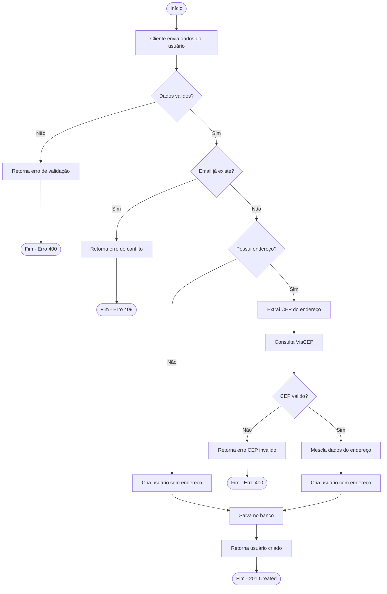

**Descrição:**
1. Cliente envia requisição POST com dados do usuário
2. Sistema valida campos obrigatórios
3. Sistema verifica se email já está cadastrado
4. Se possui endereço, consulta ViaCEP para completar dados
5. Sistema salva usuário no banco de dados
6. Retorna usuário criado com ID gerado

**Pré-condições:**
- API deve estar disponível
- ViaCEP deve estar acessível (se endereço informado)

**Pós-condições:**
- Usuário cadastrado no banco de dados
- Endereço preenchido automaticamente (se CEP válido)

---

### UC02 - Consultar Usuário

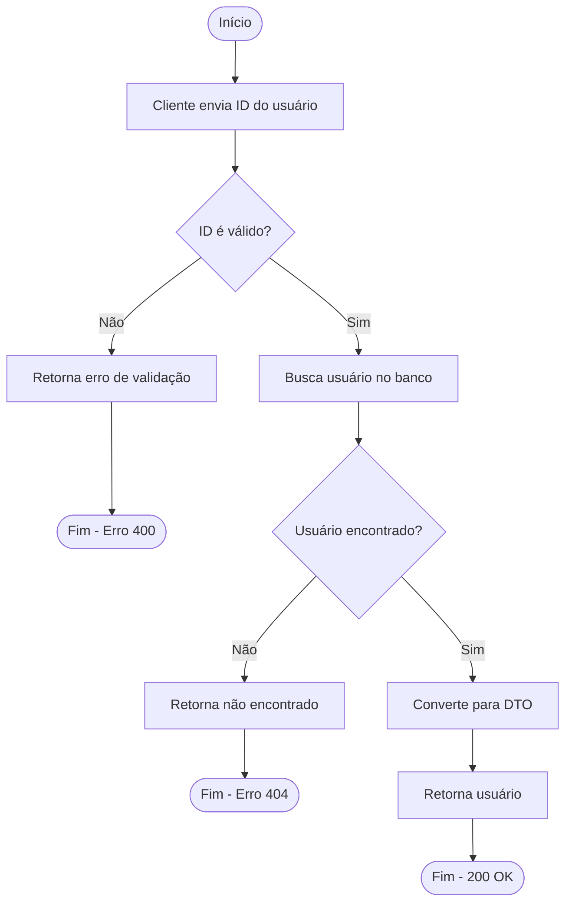

---

### UC03 - Listar Usuários

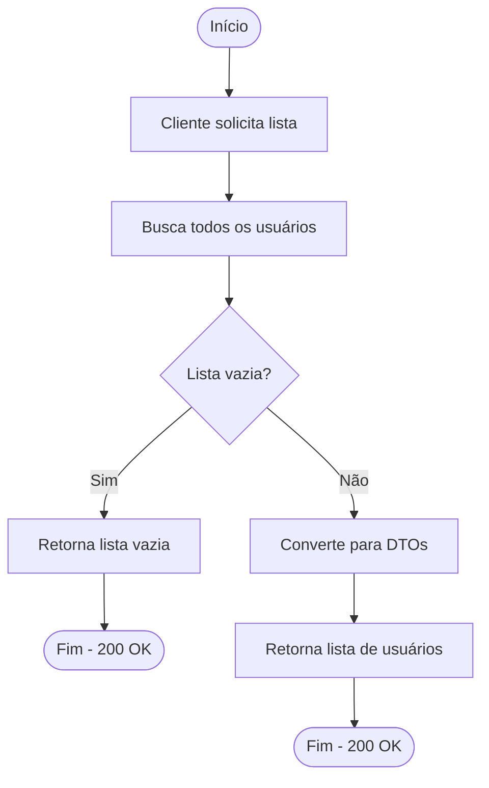

---

### UC04 - Atualizar Usuário

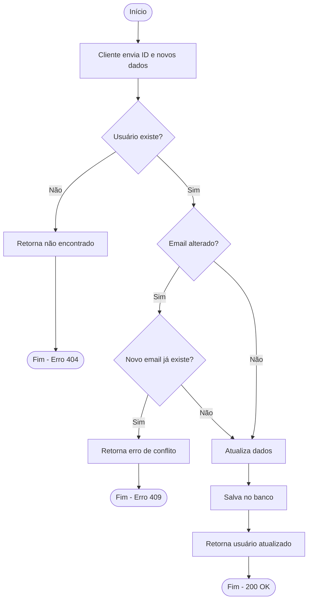

**Regras de Negócio:**
- Não permite alterar email para um já existente
- Mantém dados não informados na requisição

---

### UC05 - Remover Usuário

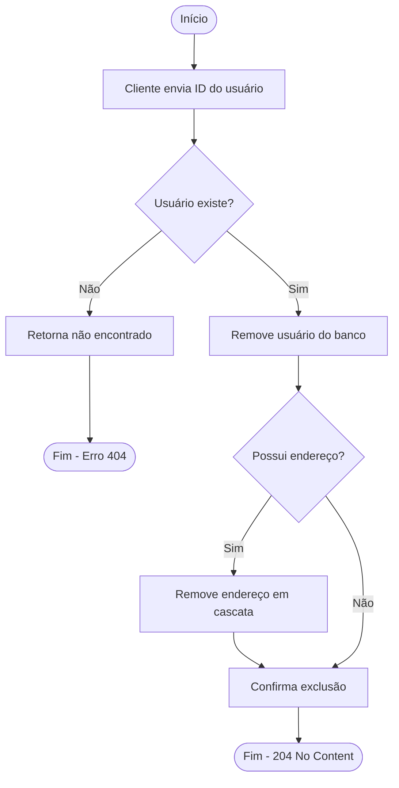

---

### UC06 - Cadastrar Endereço

```mermaid
flowchart TD
    START([Início]) --> A[Cliente envia dados do endereço]
    A --> B{CEP informado?}
    
    B -->|Não| C[Retorna erro de validação]
    C --> END1([Fim - Erro 400])
    
    B -->|Sim| D[Consulta ViaCEP]
    D --> E{CEP válido?}
    
    E -->|Não| F[Retorna CEP inválido]
    F --> END2([Fim - Erro 400])
    
    E -->|Sim| G[Mescla dados]
    Note right of G: Preserva número e<br/>complemento do cliente
    
    G --> H[Salva no banco]
    H --> I[Retorna endereço completo]
    I --> END3([Fim - 200 OK])
```

---

### UC07 - Integração ViaCEP

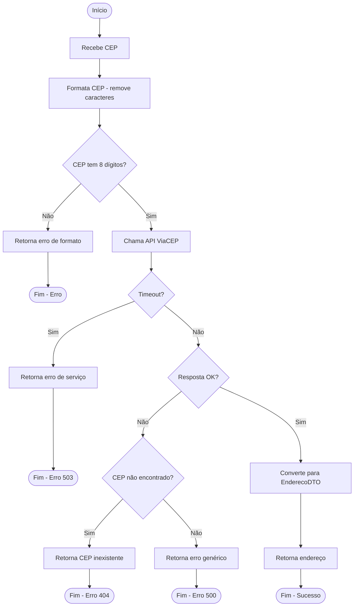

---

## Regras de Negócio

### RN01 - Unicidade de Email

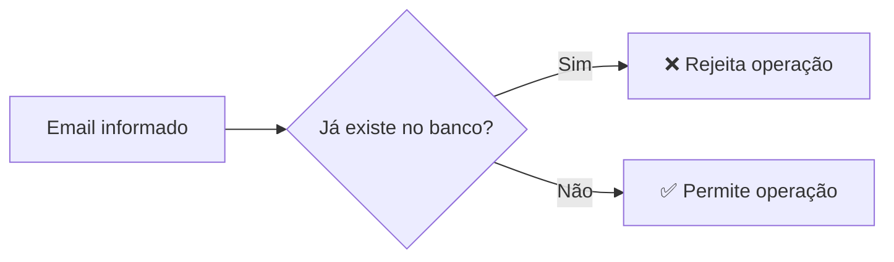

**Descrição:** O email deve ser único no sistema. Não é permitido cadastrar dois usuários com o mesmo email.

**Aplicação:** Cadastro e Atualização de usuários.

---

### RN02 - Preenchimento Automático de Endereço

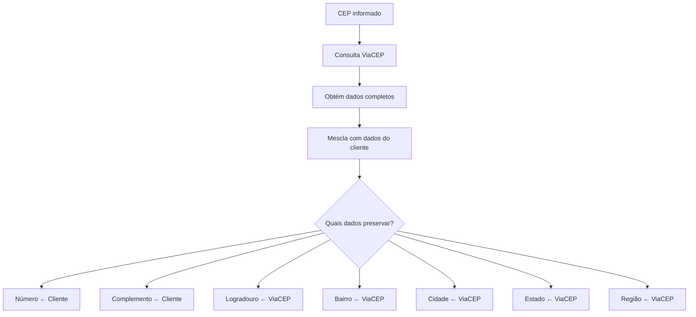

**Descrição:** Ao informar um CEP válido, os dados do endereço são automaticamente preenchidos via API ViaCEP. O número e complemento informados pelo cliente são preservados.

---

### RN03 - Exclusão em Cascata

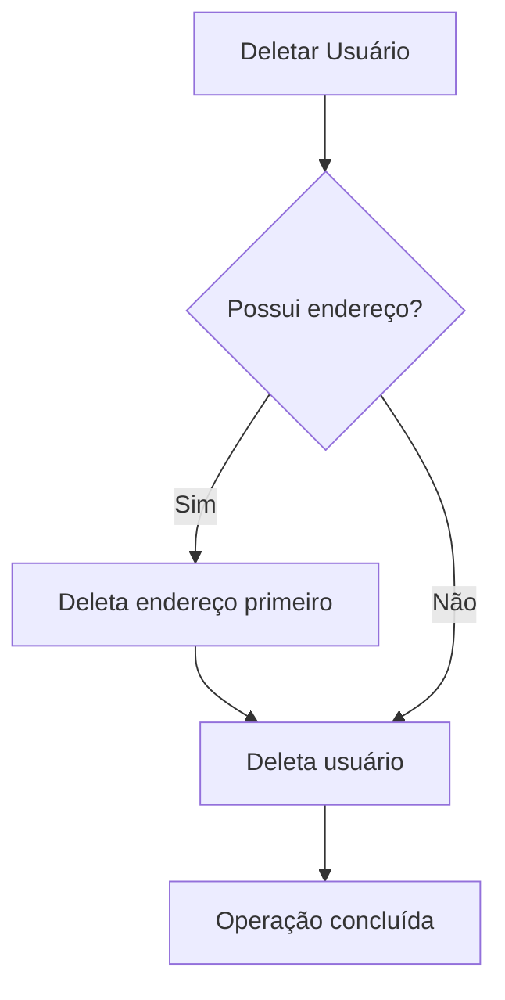

**Descrição:** Ao excluir um usuário, seu endereço associado também é excluído automaticamente (CASCADE).

---

### RN04 - Validação de Documento

| Tipo Documento | Formato | Validação |
|----------------|---------|-----------|
| CPF | XXX.XXX.XXX-XX | 11 dígitos + algoritmo |
| CNPJ | XX.XXX.XXX/XXXX-XX | 14 dígitos + algoritmo |

> **Nota:** Validação de documento está planejada para Sprint 2.

---

## Diagramas de Atividade

### Ciclo de Vida do Usuário

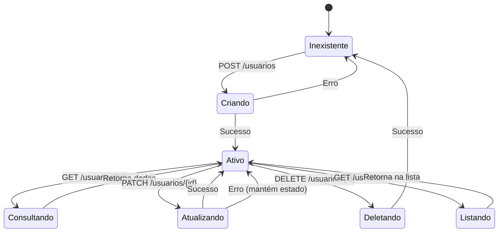

### Fluxo de Processamento de CEP

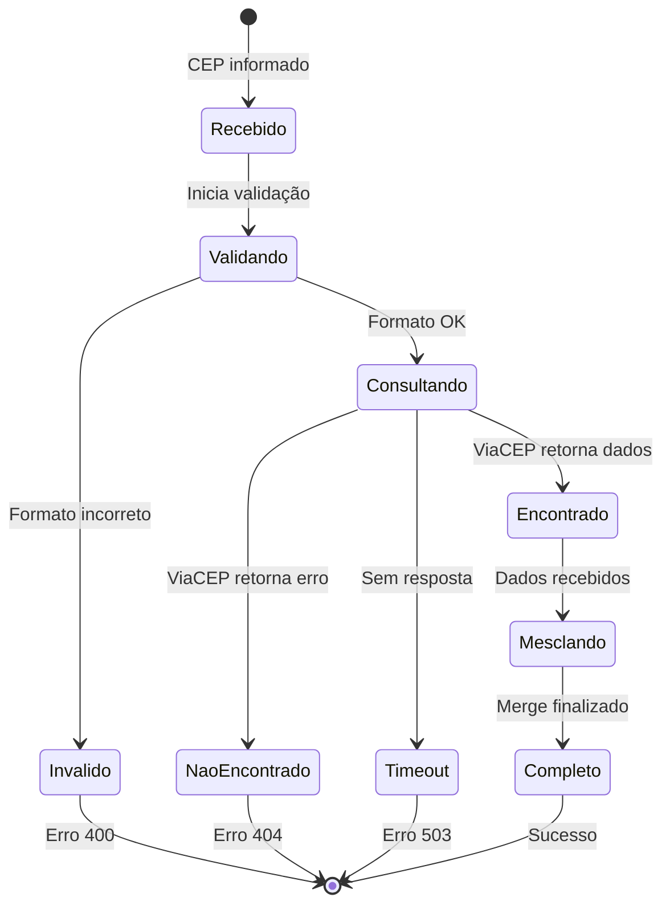

---

## Matriz de Responsabilidades

| Caso de Uso | Controller | Service | Mapper | Repository | ViaCEP |
|-------------|------------|---------|--------|------------|--------|
| Cadastrar Usuário | ✅ | ✅ | ✅ | ✅ | ✅ |
| Consultar Usuário | ✅ | ✅ | ✅ | ✅ | - |
| Listar Usuários | ✅ | ✅ | ✅ | ✅ | - |
| Atualizar Usuário | ✅ | ✅ | ✅ | ✅ | - |
| Remover Usuário | ✅ | ✅ | - | ✅ | - |
| Cadastrar Endereço | ✅ | ✅ | ✅ | ✅ | ✅ |

---

<p align="center">
  <a href="./README.md">← Voltar ao Índice</a>
</p>

