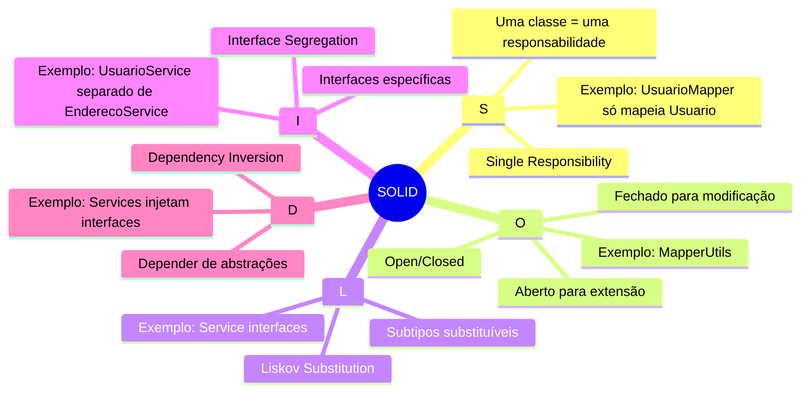

# 📖 Glossário Técnico

## 📋 Índice

- [Termos de Negócio](#termos-de-negócio)
- [Termos Técnicos](#termos-técnicos)
- [Acrônimos](#acrônimos)
- [Padrões de Projeto](#padrões-de-projeto)

---

## Termos de Negócio

| Termo | Definição |
|-------|-----------|
| **Usuário** | Pessoa física ou jurídica cadastrada no sistema, identificada por email único e documento (CPF/CNPJ). |
| **Endereço** | Localização física associada a um usuário, com dados obtidos via CEP. |
| **CEP** | Código de Endereçamento Postal brasileiro, composto por 8 dígitos numéricos. |
| **CPF** | Cadastro de Pessoa Física, documento de identificação de pessoas físicas no Brasil (11 dígitos). |
| **CNPJ** | Cadastro Nacional de Pessoa Jurídica, documento de identificação de empresas no Brasil (14 dígitos). |
| **Documento** | Identificador único do usuário, podendo ser CPF ou CNPJ. |
| **Logradouro** | Nome da via pública (rua, avenida, alameda, etc.). |
| **Localidade** | Nome da cidade ou município. |
| **UF** | Unidade Federativa, sigla do estado brasileiro (ex: SP, RJ). |
| **Região** | Divisão geográfica do Brasil (Norte, Nordeste, Centro-Oeste, Sudeste, Sul). |

---

## Termos Técnicos

### Arquitetura

| Termo | Definição |
|-------|-----------|
| **API** | Application Programming Interface - Interface de Programação de Aplicações. |
| **REST** | Representational State Transfer - Estilo arquitetural para APIs web. |
| **RESTful** | API que segue os princípios REST. |
| **Endpoint** | Ponto de acesso de uma API, representado por uma URL. |
| **Payload** | Corpo de dados de uma requisição ou resposta HTTP. |
| **Camada** | Divisão lógica da aplicação com responsabilidades específicas. |
| **Layer** | Ver "Camada". |

### Spring Framework

| Termo | Definição |
|-------|-----------|
| **Spring Boot** | Framework Java para criação de aplicações Spring com configuração automática. |
| **Spring Data JPA** | Módulo Spring para acesso a dados usando JPA. |
| **Spring MVC** | Módulo Spring para criação de aplicações web seguindo o padrão MVC. |
| **Bean** | Objeto gerenciado pelo container de injeção de dependências do Spring. |
| **Component** | Anotação que marca uma classe como componente Spring. |
| **Service** | Componente Spring que contém lógica de negócio. |
| **Repository** | Componente Spring para acesso a dados. |
| **Controller** | Componente Spring que recebe requisições HTTP. |
| **RestController** | Controller que retorna dados em formato JSON/XML. |

### Persistência

| Termo | Definição |
|-------|-----------|
| **JPA** | Java Persistence API - Especificação Java para ORM. |
| **ORM** | Object-Relational Mapping - Mapeamento objeto-relacional. |
| **Entity** | Classe Java que representa uma tabela do banco de dados. |
| **Hibernate** | Implementação mais popular do JPA. |
| **Query** | Consulta ao banco de dados. |
| **JPQL** | Java Persistence Query Language - Linguagem de consulta do JPA. |
| **Transaction** | Unidade atômica de trabalho no banco de dados. |

### Objetos de Transferência

| Termo | Definição |
|-------|-----------|
| **DTO** | Data Transfer Object - Objeto para transferência de dados entre camadas. |
| **Request** | Objeto que representa os dados de entrada de uma requisição. |
| **Response** | Objeto que representa os dados de saída de uma requisição. |
| **Record** | Tipo de classe Java imutável, ideal para DTOs (Java 14+). |
| **Mapper** | Componente responsável por converter objetos de um tipo para outro. |

### Integração

| Termo | Definição |
|-------|-----------|
| **Feign Client** | Cliente HTTP declarativo do Spring Cloud. |
| **HTTP Client** | Componente para realizar requisições HTTP. |
| **API Externa** | Serviço de terceiros consumido pela aplicação. |
| **ViaCEP** | Serviço gratuito de consulta de CEPs brasileiros. |
| **Timeout** | Tempo máximo de espera por uma resposta. |
| **Circuit Breaker** | Padrão de resiliência para evitar chamadas a serviços indisponíveis. |

### Build e Dependências

| Termo | Definição |
|-------|-----------|
| **Maven** | Ferramenta de build e gerenciamento de dependências Java. |
| **pom.xml** | Arquivo de configuração do Maven. |
| **Dependência** | Biblioteca externa utilizada pelo projeto. |
| **Lombok** | Biblioteca que gera código boilerplate automaticamente. |
| **SLF4J** | Simple Logging Facade for Java - Abstração de logging. |
| **SpringDoc** | Biblioteca para gerar documentação OpenAPI a partir de código Spring. |
| **Swagger** | Ferramenta de documentação de APIs que implementa a especificação OpenAPI. |
| **OpenAPI** | Especificação padrão para descrever APIs REST. |

### Infraestrutura

| Termo | Definição |
|-------|-----------|
| **Docker** | Plataforma de containerização de aplicações. |
| **Container** | Ambiente isolado para execução de aplicações. |
| **Docker Compose** | Ferramenta para definir e executar múltiplos containers. |
| **PostgreSQL** | Sistema de gerenciamento de banco de dados relacional. |
| **JDBC** | Java Database Connectivity - API para conexão com bancos de dados. |

---

## Acrônimos

| Sigla | Significado |
|-------|-------------|
| **API** | Application Programming Interface |
| **CEP** | Código de Endereçamento Postal |
| **CNPJ** | Cadastro Nacional de Pessoa Jurídica |
| **CPF** | Cadastro de Pessoa Física |
| **CRUD** | Create, Read, Update, Delete |
| **DDL** | Data Definition Language |
| **DER** | Diagrama Entidade-Relacionamento |
| **DML** | Data Manipulation Language |
| **DTO** | Data Transfer Object |
| **FK** | Foreign Key (Chave Estrangeira) |
| **HTTP** | Hypertext Transfer Protocol |
| **HTTPS** | HTTP Secure |
| **ID** | Identificador |
| **IDE** | Integrated Development Environment |
| **JAR** | Java Archive |
| **JDK** | Java Development Kit |
| **JSON** | JavaScript Object Notation |
| **JPA** | Java Persistence API |
| **JPQL** | Java Persistence Query Language |
| **JVM** | Java Virtual Machine |
| **MVC** | Model-View-Controller |
| **OAS** | OpenAPI Specification |
| **ORM** | Object-Relational Mapping |
| **PK** | Primary Key (Chave Primária) |
| **REST** | Representational State Transfer |
| **SLA** | Service Level Agreement |
| **SOLID** | Single responsibility, Open-closed, Liskov substitution, Interface segregation, Dependency inversion |
| **SQL** | Structured Query Language |
| **UF** | Unidade Federativa |
| **UK** | Unique Key (Chave Única) |
| **URL** | Uniform Resource Locator |
| **UUID** | Universally Unique Identifier |

---

## Padrões de Projeto

### Padrões Estruturais

| Padrão | Descrição | Uso no Projeto |
|--------|-----------|----------------|
| **Repository** | Abstrai o acesso a dados | `UsuarioRepository`, `EnderecoRepository` |
| **DTO** | Objeto de transferência de dados | `UsuarioDTO`, `EnderecoDTO` |
| **Mapper** | Converte objetos entre tipos | `UsuarioMapper`, `EnderecoMapper` |
| **Builder** | Construção de objetos complexos | Lombok `@Builder` |

### Padrões Comportamentais

| Padrão | Descrição | Uso no Projeto |
|--------|-----------|----------------|
| **Service Layer** | Camada de lógica de negócio | `UsuarioService`, `EnderecoService` |
| **Dependency Injection** | Inversão de controle | Spring IoC Container |

### Padrões Arquiteturais

| Padrão | Descrição | Uso no Projeto |
|--------|-----------|----------------|
| **Layered Architecture** | Separação em camadas | Controller → Service → Repository |
| **MVC** | Model-View-Controller | Spring MVC (sem View) |

### Princípios SOLID

---

## Códigos HTTP

| Código | Nome | Descrição |
|--------|------|-----------|
| **200** | OK | Requisição bem-sucedida |
| **201** | Created | Recurso criado com sucesso |
| **204** | No Content | Sucesso sem conteúdo de retorno |
| **400** | Bad Request | Erro de validação ou formato |
| **401** | Unauthorized | Autenticação necessária |
| **403** | Forbidden | Sem permissão |
| **404** | Not Found | Recurso não encontrado |
| **409** | Conflict | Conflito (ex: email duplicado) |
| **500** | Internal Server Error | Erro interno do servidor |
| **503** | Service Unavailable | Serviço indisponível |

---

## Anotações Java/Spring

| Anotação | Descrição |
|----------|-----------|
| `@Entity` | Marca classe como entidade JPA |
| `@Table` | Define nome da tabela |
| `@Id` | Marca campo como chave primária |
| `@GeneratedValue` | Geração automática de ID |
| `@Column` | Configuração de coluna |
| `@OneToOne` | Relacionamento 1:1 |
| `@ManyToOne` | Relacionamento N:1 |
| `@JoinColumn` | Coluna de junção (FK) |
| `@RestController` | Controller REST |
| `@RequestMapping` | Mapeamento de URL |
| `@GetMapping` | Mapeamento GET |
| `@PostMapping` | Mapeamento POST |
| `@PatchMapping` | Mapeamento PATCH |
| `@DeleteMapping` | Mapeamento DELETE |
| `@PathVariable` | Parâmetro de path |
| `@RequestBody` | Corpo da requisição |
| `@Service` | Componente de serviço |
| `@Repository` | Componente de repositório |
| `@Component` | Componente genérico |
| `@Autowired` | Injeção de dependência |
| `@RequiredArgsConstructor` | Construtor com campos final (Lombok) |
| `@Slf4j` | Logger SLF4J (Lombok) |
| `@Builder` | Padrão Builder (Lombok) |
| `@Data` | Getters, Setters, etc. (Lombok) |
| `@FeignClient` | Cliente HTTP declarativo |
| `@Tag` | Agrupa endpoints no Swagger |
| `@Operation` | Documenta um endpoint no Swagger |
| `@ApiResponses` | Define possíveis respostas HTTP |
| `@Schema` | Documenta campos de DTOs |
| `@Parameter` | Documenta parâmetros de endpoints |

---

  <a href="./README.md">← Voltar ao Índice</a>

