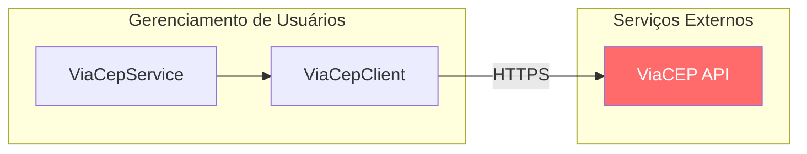
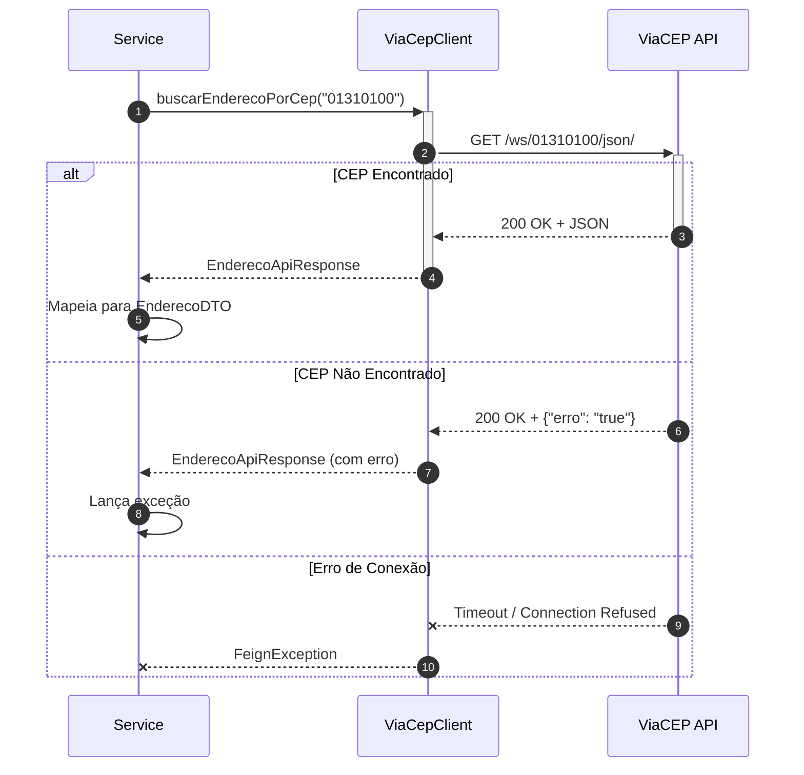
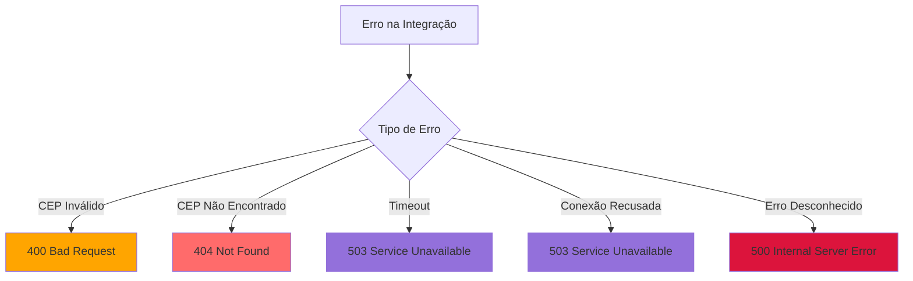
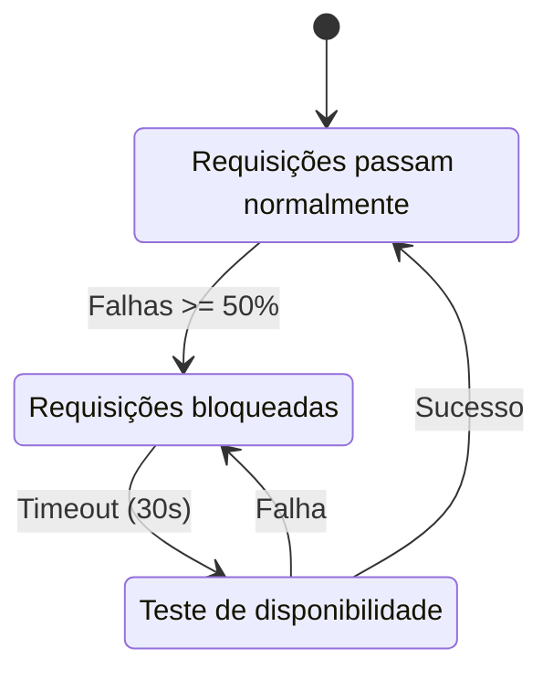
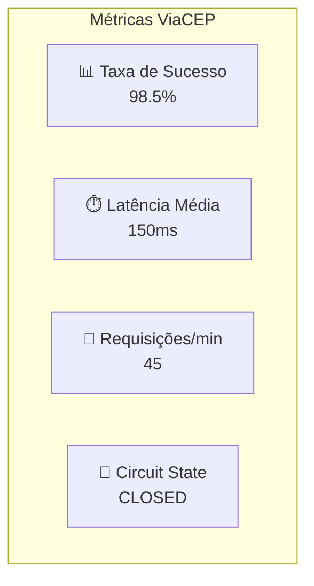

# 🌐 Integrações Externas

## 📋 Índice

- [Visão Geral](#visão-geral)
- [ViaCEP API](#viacep-api)
- [Configuração do Feign Client](#configuração-do-feign-client)
- [Tratamento de Erros](#tratamento-de-erros)
- [Circuit Breaker](#circuit-breaker-futuro)
- [Monitoramento](#monitoramento)

---

## Visão Geral

O sistema integra com serviços externos para enriquecer dados e fornecer funcionalidades adicionais.



### Integrações Atuais

| Serviço | Tipo | Protocolo | Status |
|---------|------|-----------|--------|
| ViaCEP | API REST | HTTPS | ✅ Ativo |

### Integrações Planejadas

| Serviço | Tipo | Sprint |
|---------|------|--------|
| Email Service | SMTP | Sprint 5 |
| SMS Gateway | API REST | Sprint 6 |

---

## ViaCEP API

### Sobre o Serviço

O **ViaCEP** é um webservice gratuito para consulta de CEPs do Brasil.

| Informação | Valor |
|------------|-------|
| **URL Base** | `https://viacep.com.br/ws` |
| **Formato** | JSON |
| **Autenticação** | Não requer |
| **Rate Limit** | Não documentado |
| **SLA** | Não garantido (gratuito) |

### Endpoint Utilizado

```http
GET https://viacep.com.br/ws/{cep}/json/
```

**Parâmetros:**

| Parâmetro | Tipo | Formato | Descrição |
|-----------|------|---------|-----------|
| `cep` | Path | 8 dígitos | CEP a ser consultado |

### Exemplo de Requisição

```http
GET https://viacep.com.br/ws/01310100/json/ HTTP/1.1
Host: viacep.com.br
Accept: application/json
```

### Exemplo de Resposta (Sucesso)

```json
{
  "cep": "01310-100",
  "logradouro": "Avenida Paulista",
  "complemento": "de 1047 a 1865 - lado ímpar",
  "unidade": "",
  "bairro": "Bela Vista",
  "localidade": "São Paulo",
  "uf": "SP",
  "estado": "São Paulo",
  "regiao": "Sudeste",
  "ibge": "3550308",
  "gia": "1004",
  "ddd": "11",
  "siafi": "7107"
}
```

### Exemplo de Resposta (CEP Não Encontrado)

```json
{
  "erro": "true"
}
```

### Diagrama de Sequência



---

## Configuração do Feign Client

### Interface do Client

```java
@FeignClient(
    name = "viacep",
    url = "https://viacep.com.br/ws"
)
public interface ViaCepClient {
    
    @GetMapping("/{cep}/json/")
    EnderecoApiResponse buscarEnderecoPorCep(@PathVariable("cep") String cep);
}
```

### DTO de Resposta

```java
public record EnderecoApiResponse(
    String cep,
    String logradouro,
    String complemento,
    String bairro,
    String localidade,
    String uf,
    String estado,
    String regiao,
    String ibge,
    String gia,
    String ddd,
    String siafi,
    String erro
) {}
```

### Service de Integração

```java
@Service
@Slf4j
@RequiredArgsConstructor
public class ViaCepService {
    
    private final ViaCepClient viaCepClient;
    
    public EnderecoDTO buscarEnderecoPorCep(String cep) {
        log.debug("Consultando CEP: {}", cep);
        
        String cepFormatado = cep.replaceAll("[^0-9]", "");
        
        EnderecoApiResponse response = viaCepClient.buscarEnderecoPorCep(cepFormatado);
        
        if (response.erro() != null && "true".equals(response.erro())) {
            log.warn("CEP não encontrado: {}", cep);
            throw new CepNotFoundException(cep);
        }
        
        log.debug("CEP encontrado: {} - {}", cep, response.localidade());
        return mapToDTO(response);
    }
    
    private EnderecoDTO mapToDTO(EnderecoApiResponse response) {
        return EnderecoDTO.builder()
            .cep(response.cep())
            .logradouro(response.logradouro())
            .complemento(response.complemento())
            .bairro(response.bairro())
            .localidade(response.localidade())
            .estado(response.uf())
            .regiao(response.regiao())
            .build();
    }
}
```

### Configuração no application.yml

```yaml
spring:
  cloud:
    openfeign:
      client:
        config:
          viacep:
            connect-timeout: 5000
            read-timeout: 5000
            logger-level: full

logging:
  level:
    io.github.gabitxt.gerenciamentousuario.api.client: DEBUG
```

---

## Tratamento de Erros

### Tipos de Erro



### Matriz de Erros

| Cenário | HTTP Status ViaCEP | Resposta ViaCEP | HTTP Status App | Ação |
|---------|-------------------|-----------------|-----------------|------|
| CEP Válido | 200 | JSON completo | 200 | Processa normalmente |
| CEP Inexistente | 200 | `{"erro": "true"}` | 400 | Lança exceção |
| CEP Formato Inválido | 400 | - | 400 | Validação prévia |
| Timeout | - | - | 503 | Retry ou erro |
| Serviço Fora | - | - | 503 | Circuit breaker |

### Exemplo de Handler

```java
@RestControllerAdvice
public class GlobalExceptionHandler {
    
    @ExceptionHandler(FeignException.class)
    public ResponseEntity<ErrorResponse> handleFeignException(
            FeignException ex, 
            HttpServletRequest request) {
        
        log.error("Erro na integração ViaCEP: {}", ex.getMessage());
        
        ErrorResponse error = ErrorResponse.builder()
            .timestamp(LocalDateTime.now())
            .status(HttpStatus.SERVICE_UNAVAILABLE.value())
            .error("Service Unavailable")
            .message("Serviço de consulta de CEP indisponível")
            .path(request.getRequestURI())
            .build();
            
        return ResponseEntity
            .status(HttpStatus.SERVICE_UNAVAILABLE)
            .body(error);
    }
}
```

---

## Circuit Breaker (Futuro)

> 📋 **Planejado para:** Sprint 5

### Configuração Resilience4j

```yaml
resilience4j:
  circuitbreaker:
    instances:
      viacep:
        registerHealthIndicator: true
        slidingWindowSize: 10
        minimumNumberOfCalls: 5
        permittedNumberOfCallsInHalfOpenState: 3
        automaticTransitionFromOpenToHalfOpenEnabled: true
        waitDurationInOpenState: 30s
        failureRateThreshold: 50
        eventConsumerBufferSize: 10
  
  retry:
    instances:
      viacep:
        maxAttempts: 3
        waitDuration: 1s
        enableExponentialBackoff: true
        exponentialBackoffMultiplier: 2
```

### Diagrama de Estados



---

## Monitoramento

### Métricas Recomendadas

| Métrica | Descrição | Alerta |
|---------|-----------|--------|
| `viacep.requests.total` | Total de requisições | - |
| `viacep.requests.success` | Requisições com sucesso | - |
| `viacep.requests.failure` | Requisições com falha | > 10% |
| `viacep.latency.p99` | Latência P99 | > 2s |
| `viacep.circuit.state` | Estado do circuit breaker | OPEN |

### Dashboard (Futuro)



### Logs Estruturados

```java
// Exemplo de log estruturado
log.info("viacep.request cep={} status={} latency={}ms", 
    cep, "SUCCESS", latencyMs);

log.warn("viacep.request cep={} status={} error={}", 
    cep, "NOT_FOUND", "CEP inexistente");

log.error("viacep.request cep={} status={} error={} exception={}", 
    cep, "ERROR", "Timeout", ex.getMessage());
```

---

## Boas Práticas

### ✅ Recomendações

1. **Sempre valide o CEP** antes de chamar a API
2. **Implemente timeout** adequado (5s recomendado)
3. **Use cache** para CEPs já consultados
4. **Monitore latência** e taxa de erro
5. **Implemente circuit breaker** para resiliência
6. **Log todas as requisições** para troubleshooting

### ❌ Evite

1. Consultar CEPs claramente inválidos
2. Fazer muitas requisições simultâneas
3. Depender 100% da disponibilidade do serviço
4. Armazenar dados sensíveis do ViaCEP

---

## Referências

- [Documentação ViaCEP](https://viacep.com.br/)
- [Spring Cloud OpenFeign](https://docs.spring.io/spring-cloud-openfeign/docs/current/reference/html/)
- [Resilience4j](https://resilience4j.readme.io/)

---

<p align="center">
  <a href="./README.md">← Voltar ao Índice</a>
</p>

